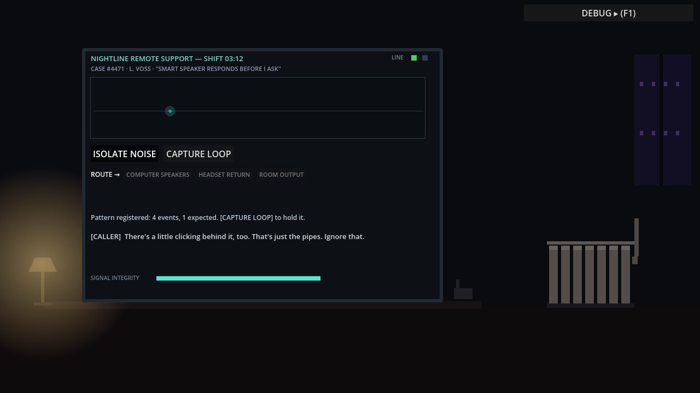
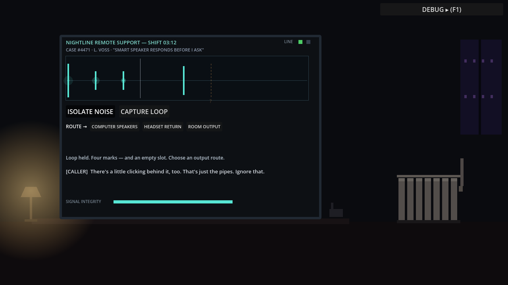
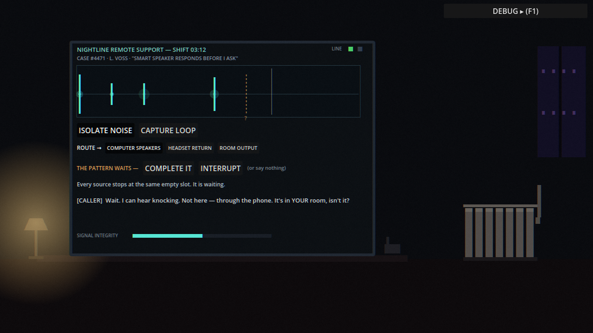
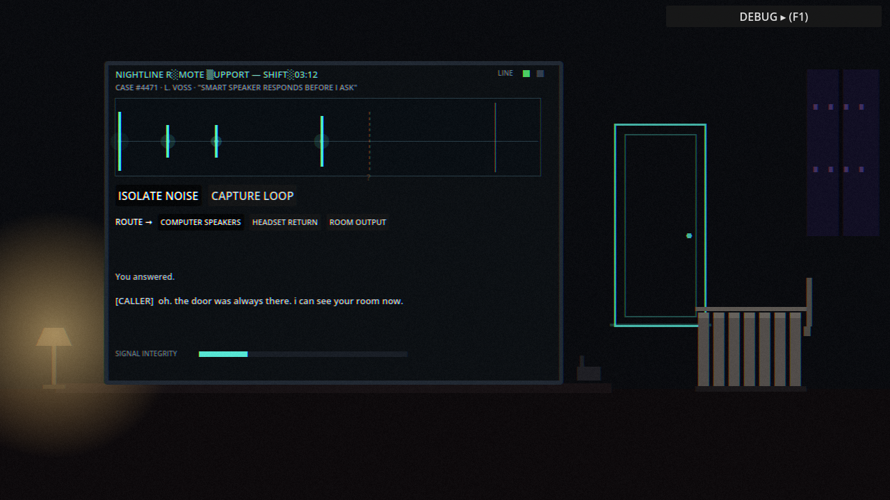

# The Audio Virus — Experiential Prototype

A standalone Godot 4.x prototype for a narrative game about a remote support
worker who diagnoses impossible technical problems through sound. During a
night support call, a four-beat pattern hidden in the caller's breathing
crosses into the player's apartment — and waits for an answer.

The core design rule: **sounds are bodies, motifs are ideas.** The same
abstract motif (`incomplete_knock`) is rendered by breathing, a radiator,
a computer notification, electrical hum, and a human voice — each through
its own physical limitations.

## Setup and Run

1. Install [Godot 4.2+](https://godotengine.org/download) (standard build, no extras).
2. Open Godot → **Import** → select `audio_virus_prototype/project.godot`.
3. Press **F5**. The prototype launches directly into the support call.

Everything is procedural — no external assets, no network, no third-party
plugins. It runs offline from a clean checkout. Headphones recommended.

## How to Play

1. Listen to the call. The interface will flag an anomaly on the background channel.
2. **ISOLATE NOISE** — ducks the caller's voice and foregrounds her breathing. Listen for the pattern: *short — short — long gap — short — …nothing.*
3. **CAPTURE LOOP** — holds the pattern. The timeline shows four solid marks and one dashed empty slot.
4. **ROUTE** it somewhere: computer speakers, headset return, or room output. Playing it into the room has consequences.
5. When everything in the room stops at the same empty slot, you may **COMPLETE IT**, **INTERRUPT**, or say nothing. No option is labeled correct. All three end differently.

The run can be restarted at any time (debug panel → RESTART SEQUENCE, or the
button on the case-closed screen) without reloading the editor.

## Debug Panel

Press **F1** (or click the DEBUG header). It exposes: current stage,
infection levels, active motif/renderers, response state, per-source replay
buttons, skip-to-stage buttons, restart, event-marker toggle, sliders for
tempo / timing drift / infection / master volume, master mute, and a master
peak readout with a near-clip warning. State transitions are logged to the
Godot output console as `[STATE] …` lines.

## Project Structure

```
audio_virus_prototype/
├── project.godot                  # autoloads: GameState, AudioEnv
├── scenes/Main.tscn               # thin root; the set is built in main.gd
├── scripts/
│   ├── main.gd                    # scene controller + staged call sequence
│   ├── autoload/game_state.gd     # run state + signals (the decoupling hub)
│   ├── autoload/audio_env.gd      # mix buses built in code (Room/Caller/UI)
│   ├── motif/motif_definition.gd  # the motif data model (Resource)
│   ├── motif/translation_profile.gd # how one body interprets a motif (Resource)
│   ├── motif/motif_renderer.gd    # reusable renderer node (one per body)
│   ├── motif/audio_factory.gd     # all sounds, synthesized at startup
│   ├── env/                       # lamp, radiator, door outline props
│   └── ui/                        # waveform view, debug panel
├── resources/
│   ├── motifs/incomplete_knock.tres
│   └── profiles/*.tres            # 5 translation profiles
├── shaders/screen_distortion.gdshader
└── tests/                         # headless smoke test + screenshot driver
```

See `docs/ARCHITECTURE.md` for the architecture summary, the motif data
model, and step-by-step instructions for adding a new motif or profile.

## Screenshots

Rendered from the real build by `tests/Screenshot.tscn` (see `docs/screenshots/`):

| | |
|---|---|
|  |  |
| *Isolated background channel* | *Captured loop: 4 marks + the empty slot* |
|  |  |
| *Transmission: the room has the pattern* | *Complete outcome: the door that was always there* |

## Placeholder Assets and Their Sources

There are **no imported assets**. Every sound is synthesized by
`scripts/motif/audio_factory.gd` at startup (knock partials, sine tones,
filtered noise for breath/murmur/static, seamless mains-hum loop). Every
visual is a flat-color `ColorRect`, `_draw()` call, or generated gradient
texture. The screen distortion is a single hand-written shader. The
caller's "voice" is speech-shaped band noise — deliberately wordless — with
subtitles carrying the dialogue.

## Headless Test

With a Godot binary on PATH:

```
godot --headless --path audio_virus_prototype --import          # first time
godot --headless --path audio_virus_prototype res://tests/AutoTest.tscn
```

The test plays the real sequence end-to-end (isolate → capture → misroute to
headset → reroute to speakers → complete → restart) and exits non-zero on
any failed check. `tests/Screenshot.tscn` renders framegrabs of each beat
under `xvfb-run` for documentation.

## Manual Test Checklist

- [ ] Launches directly into the support call; caller dialogue begins.
- [ ] ISOLATE unlocks after the intro lines; isolating makes the 4-event motif clearly audible and pulses appear on the timeline.
- [ ] CAPTURE shows 4 solid markers + 1 dashed "?" slot; loop repeats audibly with a moving playhead.
- [ ] Repeated CAPTURE presses restart the loop cleanly (no doubled audio).
- [ ] HEADSET route: caller reacts, room stays quiet, transmission does not start.
- [ ] SPEAKERS/ROOM route: after a delay the radiator knocks the pattern back, shaking visibly; lamp pulses with accents; notification tones quote the contour head; hum thickens.
- [ ] Switching routes mid-playback does not stack or break playback.
- [ ] COMPLETE: hummed fifth note → radiator answers → brown-out → door outline appears → caller whisper. Infection stays elevated.
- [ ] INTERRUPT: radiator drifts, lamp/notification desync, motif mutates, caller hears another voice.
- [ ] SILENCE (do nothing ~16 s): everything fades, then the fifth beat arrives from behind; caller whisper.
- [ ] Only one outcome ever triggers per run; buttons after commit are no-ops.
- [ ] Corporate screen always reads CUSTOMER EDUCATED / ISSUE RESOLVED.
- [ ] RESTART during any of the above yields a clean, working new run.
- [ ] F1 debug: per-source replay works, skip-to-stage works, sliders respond, peak never reads past −1 dB under normal play.
- [ ] Alt-tab away: audio mutes and the sequence pauses; returning resumes.
- [ ] Playable with sound off: subtitles + timeline markers + lamp/radiator/door visuals carry the sequence.

## Known Limitations

- The set is deliberately crude: flat rectangles and `_draw()` props. Audio was the budget.
- "Source separation" is faked by crossfading mix layers, per the brief.
- The caller has no recorded voice; murmur noise + subtitles stand in. Real (or synthesized) line reads are the single biggest polish lever.
- Stereo panning only — no HRTF. "Behind the player" is approximated with pitch, reverb, and screen response rather than true rear placement.
- The hum's pitch contour is subtle by design; on laptop speakers it may read as texture rather than melody.
- Focus loss pauses the whole tree; on some window managers rapid focus flapping can double-trigger mute/unmute harmlessly.
- The mutation system produces one warped variant; it is a seed, not a full ecology.

## What to Test With Players Before Expanding

1. **The recognition moment.** Do players connect the radiator's knocking to the captured loop *without* being told? (The emotional success criterion: "oh shit, they're listening to each other.") Watch for the moment their eyes move from the monitor to the radiator.
2. **Is the missing fifth event legible** from repetition + the dashed slot alone, or do players need the hint text? Try a build with `_hint` blanked.
3. **Do players discover silence as a choice**, or do they experience it as a timeout? If the latter, the wait needs a stronger "the room is holding its breath" cue rather than more UI.
4. **Do the three outcomes feel consequential and unranked?** Ask players afterwards which one was "correct" — the design goal is that they argue.
5. **Isolation listening time.** Is ~2 loops enough to *hear* the pattern before capture unlocks, or does the unlock preempt discovery?
6. **Does anyone try to route to the headset first**, and does the caller's reaction make that feel like a real transmission path rather than a dead end?
