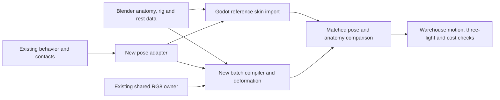

# Dream critters: Blender anatomy and animation rebuild

Evidence class: **INERT** — owner-requested analysis and implementation plan. This is a proposal, not art acceptance, runtime proof or a release decision.

Date: 2026-09-19. Audited production: **C:/ov/astra-main-acdb4be**, branch **codex/astra-reconcile-20260919**, source revision **b98cecb2e4605bae7dd949ed147639b3d662b595**. Scope: the sixteen **DreamCritterController** species currently exhibited in the dream ecology warehouse. This document specifies the rebuild; it does not claim that new Blender assets, stripe removal or the new renderer have been implemented.

The owner wants continuous, detailed anatomy, mechanically believable deformation, distinct silhouettes/materials/motion, removal of the conspicuous stripes, and organic alien interiors informed by microbiology and alien concept art. Preserve the accepted species identities and behavior ownership. Their fantastic scale and authored impossible laws remain deliberate fiction.

**Dossier reconciliation, 2026-09-19:** resumed after the owner supplied **design/DREAM_BIOLOGY_REFERENCE_DOSSIER_2026-09-19.md** from main at **e8b83a3f7a9546fe02a0dea9312b9efd85975beb**. Read that exact Git object and the referenced visual doctrine and specimen ledger. Its 100-source reference catalogue informs this plan; its INERT status changes no ruling. The dossier has eighteen grouped organ/style categories across the Dream, while this rebuild has sixteen warehouse species. The older temporal ledger uses another audit classification; none of those counts is a replacement bestiary.

The revised direction is **living cloisonné with continuous anatomy**: aubergine-black body mass, wine tissue, anatomically placed gold filaments and bounded existing jewel accents. This replaces the first draft's broad ivory, cyan, citron and other independent species palettes. Distinction comes from where materials occur, their thickness/opacity/roughness, compartment proportions and motion. The user-rejected broad stripes remain scheduled for removal.

The companion **design/astra/DREAM_CRITTER_REFERENCE_MAP_2026-09-19.json** is planning-only reference metadata: source roles, numbered dossier links, inherited licence notes, explicit limitations and supplemental mechanism papers for all sixteen. It is not read by the game or an implemented creature importer. Dossier numbers below are preserved; additional research does not renumber its sources.

**Owner priority update, 2026-09-19:** incorporate the supplied *The Dream's Alien Life, and How to See It* inventory and complete the directly researched organisms before redesigning the other forms. Here that means the thirteen named biological specimens, species 03–15, with direct mechanism papers. The three fictional templates also have researched analogies, but follow those thirteen. New pilot order: **tardigrade → Vorticella → Lacrymaria → Volvox**. Fold crab is no longer an early pilot. Stable species IDs and existing behaviors do not change when work priority changes.

## 1. Assessment of the current animals

Reviewed the sixteen-species [warehouse contact sheet](C:/ov/astra-ecology-20260919/DreamEcologyWarehouseTest_reviewed/contact_sheet.png), individual close-ups, species definitions, mesh construction, motion shaders and the existing Blender pipeline. The [warehouse handoff](C:/ov/astra-main-acdb4be/design/astra/DREAM_ECOLOGY_WAREHOUSE_2026-09-19.md) records the current debug integration and prior tests; this review does not rerun or upgrade those receipts.

The roster has useful behavioral identities, especially the planted crab, contracting water bear, searching neck and sliding diatom colony. The visual construction is the limiting factor. Many animals share a polished gold/green finish, repeating luminous bands and recognizable sphere/tube components. Small texture detail cannot repair the disconnected anatomical transitions.

| Finding at the audited revision | Consequence for the rebuild |
|---|---|
| [Mesh construction](C:/ov/astra-main-acdb4be/game/scripts/dream/critters/dream_critter_controller.gd:151) creates 56 disconnected primitive islands per draw slot: body, nine detail spheres, eight limbs, twelve feelers, two tubes, eight webs and sixteen branches. Twelve slots total 672 islands and 84,000 triangles. These are source-derived counts, not a Blender manifold report. | Replace the primitive template with authored tissue compartments. Increasing its subdivisions would preserve disconnected roots and waste triangles on unused parts. |
| Tubes lack end caps; angular seams duplicate vertices; sphere poles include degenerate triangles. | Validate welded authoring topology and anatomical openings before export. GPU vertex splits at UV seams are a separate issue. |
| Several body, crown, limb and internal-organ transforms differ. Vorticella's crown and organs travel twice the body's contraction displacement. | All connected anatomy must inherit the same deformation frame. Blender art and runtime deformation need to change together. |
| [Vertex shading](C:/ov/astra-main-acdb4be/game/shaders/dream_critter.gdshader:492) rotates primitive normals without reconstructing the deformed surface normal. Mesh construction supplies no tangents, although fragment shading uses them. | Export and deform normals/tangents correctly; inspect grazing light and moving highlights as well as silhouettes. |
| The current material is opaque. Enclosed organs are largely hidden; apparent depth relies on shading or protruding geometry. | Real internal visibility needs an explicit optical prototype. Merely adding internal meshes will not deliver the requested result. |
| Broad stripes originate in shader equations, including the voxel response, rather than a single texture. | Remove the band generators and their color/relief modulation together. Replacing an albedo image alone will not remove them. |

The twelve newer forms are biologically inspired, but some presentations overstate the mechanism currently drawn: Volvox scales closed daughter spheres instead of inverting a sheet; Salpingoeca's unfurl state does not unfurl its geometry; Euplotes' terminal branches do not follow the same gait as their supporting limbs. Correct the visual realization while retaining the current state transitions.

### Supplied zoo inventory and source recovery

The September 19 owner-supplied inventory is a map of existing work, not a request to merge every backup. Local Git inspection pins main at **e8b83a3**, the accepted sixteen-species voxel branch at **efc5d61**, S2 backup at **d8a57d0**, main-checkout backup at **e06270f**, and lamp optics at **4aa4585**. The prepared warehouse selectively incorporated the accepted critter sources at **b98cecb2**; main still contains only the original three critter species. The full S2 presentation stack remains separate. Its tissue studies are not finished models for this roster, and S2J's failed material-identity gate is not superseded by later scoped motion acceptance.

| Inventory | Use in this pass |
|---|---|
| Hero tentacle, six margin archetypes, branches/cilia, living architecture and organelle signaling | Recover the missing original Blender source and expose the existing ensemble in a dedicated debug warehouse station, as subsequently requested by the owner. Reuse anatomy/tooling; no new organ ruling. |
| Sixteen current critters | Retain live warehouse behavior. Regenerate IDs 03–15 first in the exact order below; IDs 00–02 follow. |
| Gilder's Button, Tessellate, Wine Anemone, Ribbonette, The Loupe | Existing separate DreamFaunaDirector families. Reserve labeled warehouse bays until their own runtime display is integrated. |
| Pursuer and hazards | Existing maze-only encounter systems; labeled reserved bays, preserving their encounter ownership. |
| Cellular moss/cilia/membranes and S2 surface tissue | Preserve accepted branch and later WIP provenance separately; reserve a surface-study bay rather than claim wholesale integration. |
| Mina, Peter, Juno, Mae, Cal and Omar | Six surface incarnations on the same Dream body. One material-study reservation, never six invented species. |
| Jewelfruit, Spiralings, Chandelettes, Bezel Beetles, Deep Koi, Parliaments | Designed but unbuilt. Explicit placeholder bays; defer modeling until after researched organisms. |

The missing **art/blender/dream_tentacle.blend** is recoverable as an ordinary tracked Git blob from **e06270f7b6266fb5d14b28ff1cea5d007b39aa33**: blob **7c8a1cbfbb47237efd93072ff6b14e94e04d31fa**, **758,368 bytes**. Its builder, baker, shipped GLB and anatomy map match the current tracked assets. Recovery and successful loading must be recorded separately from regeneration parity, which requires export/bake comparison. The owner's subsequent rescue request authorizes recovering this specific source, not restoring the whole unrelated backup.

Inspection remains through the shared lane, with explicit project, windowed mode, log and a fresh output directory. **DreamHeroSweep uses SWEEP_DIR**, while the lane's **-ShotDir sets SHOT_DIR**; set SWEEP_MODE separately. The modelled sweep also requires **DREAM_HERO=1**. Its critters mode samples an opportunistic population and aims for three species, so it is not the sixteen-species census. The warehouse is that census. DreamMicroorganismMotionShot covers twelve microorganisms, excluding tardigrade and the original three; its accepted motion packet does not certify all sixteen gameplay behaviors. Family shots cover the separate five-family director; DreamFaunaSkinShot is a studio comparison. Sweep missing-subject failures can print errors and still exit zero: inspect frame counts and diagnostic logs, and do not call them schema-2 runtime proof.

## 2. Art direction and reference method

Build each animal from a simple anatomical explanation: what holds it together, what produces force, where feeding/sensing happens, and what its internal material is doing. Every visible organ needs a location, boundary and relationship to the surrounding tissue. Protists should have cortices, vacuoles, cytoplasmic strands and organelles appropriate to their inspiration; the animal forms can have muscle, gut and joint membranes.

The alien quality comes from unfamiliar arrangement and material behavior: a mineral resonator suspended in wet wine tissue; a feeding neck unfolding from stored membrane; a large vacuole surrounded by a thin active rind; an embryo turning through an opening inside its parent. Dense tissue should occlude and drag on neighboring tissue. Thin rims should soften in transmitted light. A loaded joint should compress its membrane and shift its folds. Internal motion must feel contained, with slower settling than the impulse that displaced it. Gold grows along selected compartment boundaries, insertion collars and load-bearing supports, with taper and biologically motivated junctions. It must remain attached through deformation.

Use **D49** (cloisonné construction), **D79** (Binet's biomineral-to-wire interpretation), **D85** (wire/cell proportions) and **D82** (Gallé's translucent organic material) as the material anchors. Anatomy owns the compartments; material enriches them. The gold must explain a boundary or support rather than drawing equally spaced stripes across every body. The Met's [Saint Paul medallion, D85](https://www.metmuseum.org/art/collection/search/464546) is a reference for enamel and metal partition proportions, not an organism or a palette to reproduce.

Use three complementary art references:

| Original reference | Specific lesson to apply |
|---|---|
| [Wayne Barlowe, Expedition](https://waynebarlowe.com/artwork/expedition/) — dossier D96 | His commentary relates anatomy to feeding niches and shared evolutionary motifs. Use a small family of membrane collars, mineral growth interfaces and sensory structures, then vary their functional arrangement across species. Do not borrow an existing creature's silhouette, palette or decorative pattern. |
| [Alex Ries, Ventgarden development](https://abiogenesis.artstation.com/projects/0XXnqy), with the function and anatomical-detail sheets in his [concept portfolio](https://www.alexries.com/concept-art) | Treat an interior and its habitat attachment as one design problem. Give colonies an intelligible matrix, feeding orientation and internal spatial hierarchy. This is a speculative-art reference, not evidence about protists. |
| [Terryl Whitlatch, original interview](https://www.sffworld.com/2016/03/interview-with-terryl-whitlatch/) | Adapt her anatomy-and-locomotion preparation into three aligned sheets: exterior; support/contractile structures; internal compartments. The support layer can be a cortex or hydrostat rather than a vertebrate skeleton. |

Each specimen's reference sheet must label organism, image method, source URL, observed mechanism and proposed extrapolation. Record the role of each use: biological mechanism, comparative anatomy, artistic interpretation or optical technique. SEM describes relief; fluorescence and segmented tomography describe locations, not necessarily natural color. The [tardigrade muscle study](https://pmc.ncbi.nlm.nih.gov/articles/PMC3877342/) and [Volvox inversion study](https://pmc.ncbi.nlm.nih.gov/articles/PMC4685841/) are examples where stained or false-colored imagery must not become automatic albedo palettes.

Apply the dossier's form-only boundary throughout: no tracing, projection, photobashing, image-derived displacement/normal, texture baking from references, or feeding reference imagery into an image generator. Never commit or ship reference image bytes. PD/CC0 images may appear on internal review sheets; reproduce CC BY/CC BY-SA images only with their required attribution and terms. Copyright/reference-only entries stay in their source pages, never in a downloaded board. URL-only review is sufficient here. Bake maps from our original modeled anatomy, and keep reference inputs physically separate from generated substance intake. If later making AI substance plates, describe the material in words and omit living artist/studio names, following the dossier's recommendation.

The Dream may observe specimens from any era. Waking-world objects retain the strict **1927** Rule of Signal; a period-safe source is not permission to add a prop or to claim a character saw it. Preserve source-specific cautions about modern photographs of old objects and works that existed but were not publicly available. This rebuild adds no waking-world reference plate, book or instrument.

**Negative references:** dossier D99 covers Giger, Beksiński and Scorn. Avoid industrial ribbed tubing, machinery fused into flesh, corpse-like desaturation and their signature threat language. D93's petrol-rainbow treatment is also excluded. D96 informs sensory/body logic; it does not authorize Barlowe silhouettes or earthy palette. Our visceral quality should come from tissue pressure, contained active interiors, organic attachment and the wine/gold response.

### Material and light rules carried into every specimen

Use the established **GROUND** family near **#1d1a20**, dark-live **WINE**, antique **GOLD**, and bounded **EMERALD / CARNELIAN / LAPIS** tokens. The starting visual allocation remains approximately 70% ground, 20% wine, 8% gold response and 2% jewel; this is an art-direction proportion, not a demand that screen pixels retain that ratio under every light. Use one localized jewel organ, with no invented fourth accent or new danger cue. Carnelian remains restricted by existing danger-allegiance rules; these harmless specimens gain no new warning cadence. Different opacity, relief, roughness and compartment placement provide variety within the shared family.

Apply the current V12 three-state doctrine, which supersedes the older wine-only-dark language: **dark = bounded anatomical neon on black; oblique = translucent wine tissue, branching veins/rim and wet film; sustained full beam = lamp-driven molten gold and living enamel**. Blend continuously with rate-limited luminance. Light changes appearance; it does not move attachment topology, collision or behavior authority. Existing creature locomotion and laws still drive anatomical deformation. World shadow casting remains OFF; internal occlusion and contact readability must be achieved within that boundary.

### Continuous topology and detail hierarchy

1. **Continuous tissue:** weld the body into limb roots, feeding rims, necks and soft attachment collars wherever the anatomy is continuous. Mouths and pores need a rim, wall and interior termination or lumen. A deliberate opening must not be an accidental uncapped tube.
2. **Separate anatomical compartments:** organs and rigid plates may be separate closed meshes. Document whether each is suspended, tethered, sliding or embedded. Colony cells remain distinct cells joined by matrix or overlap; do not fuse a diatom raft into one rubber body.
3. **Strain-aware retopology:** use continuous loops along load and shortening directions, reserve folds at compression sites, and sufficient cross sections for extended necks and bent stalks. Sculpt/remesh can establish volume; final deformation topology needs deliberate retopology.
4. **Three scales of detail:** silhouette and major chambers in geometry; sockets, lips, plate overlaps and large folds in mid-scale geometry; pores, ciliary basal pits, mineral etching and fine cortex relief in baked maps. Dense cilia can use rooted procedural curves in Blender, realized into the appropriate export LOD.
5. **Controlled asymmetry:** vary growth, organ packing and small defects around authored landmarks. Seeded variation must preserve species bounds, attachment positions and the existing rare-appendage rules.

### Remove the stripes comprehensively

Audit and replace the broad comb, chamber, annular, spiral, lattice and stria color functions in [dream_critter_voxel_optics.gdshaderinc](C:/ov/astra-main-acdb4be/game/shaders/dream_critter_voxel_optics.gdshaderinc), including the especially visible Volvox lattice. Remove the listener's ordered-band/polar-flash treatment in [dream_critter.gdshader](C:/ov/astra-main-acdb4be/game/shaders/dream_critter.gdshader). Review downstream generic surface blending so it does not reintroduce bands after species shading.

Replace them with authored thickness, pigment, roughness, mineral fraction and organ masks. Keep structural features such as cuticle folds and frustule pores subtle, localized and physically placed. The owner's stripe-removal direction supersedes older plans that called for luminous bands. Do not turn every creature into the same mottled noise pattern.

Keep RG8 semantics: **R is durable exposure; G is reversible current irradiance**. Map them to species-specific optical appearance, such as gradual pigment change, scattering and tissue visibility. Noctiluca's flash remains triggered by its existing mechanical/debug state; irradiance must not become a substitute trigger. Reuse the same field sampler and world coordinates. Shared hero includes must not be globally altered merely to fix critter appearance.

## 3. The sixteen regeneration specifications

The material allocations below are proposed within the shared palette, not microscopy-derived natural colors. Review all sixteen under neutral white light and the three production light states. Each row needs a black-silhouette test, a roughness/transmission swatch and a motion-only comparison. A localized jewel accent must follow the existing token and danger/allegiance rules; its final location is part of the anatomical sheet, not another colored skin.

| ID / species | Silhouette and distinct material allocation | Distinct motion signature to preserve |
|---|---|---|
| 00 Seam grazer | Low asymmetrical mantle; satin-dark back, thin wine frill, localized gold ventral comb roots | Seam-hugging glide, ventral contact compression and comb fan; one identity appearing on both sides of a wall |
| 01 Crystal listener | Compact radial body; dark mineral cage, vitreous wine chamber, fine gold radial supports around one jewel resonator | Long stillness interrupted by internal resonator rotation and small receiver responses |
| 02 Fold crab | Raised wedge and heavy mouth-limbs; worn gold cup edges, substantial dark plates, wet wine joint membranes | Discrete planted steps and a clearly isolated impossible leg-fold event |
| 03 Tardigrade | Heavy lobes and eight soft legs; cloudy wine cuticle, dense dark interior, sparse gold insertion collars and thin viewing regions | Deliberate weight transfer, soft settling and whole-body tun contraction |
| 04 Stentor | Wide rooted trumpet; satin wine cortex, wet oral rim and finely rooted gold ciliary insertions | Oral ciliary wave, abrupt whole-body shortening, current timed habituation sequence |
| 05 Lacrymaria | Teardrop and very long neck; dense dark trunk, thin wine deployed membrane, gold confined to root/terminal supports | Irregular bounded search, pleat deployment and recoiling reach |
| 06 Vorticella | Bell on an attached stalk; glossy wine bell, restrained transparent windows, narrow gold core and holdfast | Rapid helical withdrawal followed by slower stalk recovery |
| 07 Euplotes | Asymmetric flattened shield; smooth dark dorsum, wine ventral tissue and small gold cirral sockets | Distinct cirral stance/swing groups through the existing finite gait states |
| 08 Spirostomum | Long spindle; finely rough dark cortex, wine inner chain, gold only at selected subcortical junctions | Fast coupled shortening/widening and twist, followed by slower elongation |
| 09 Heliozoan | Vacuolate sphere with tapered rays; dark empty volume, thin wine pockets, gold ray bases with clear sheaths | Near-still radial field interrupted by one selected ray retracting |
| 10 Euglena | Twisting spindle; polished wine pellicle, dense dark plastid compartments, one localized jewel organ | Traveling metaboly and an asymmetric flagellar beat |
| 11 Volvox | Cellular globe; wine cell islands and fine gold junctions around an open dark volume; one bounded jewel inclusion | Slow parent rotation with an independently phased daughter-sheet inversion |
| 12 Noctiluca | Uneven thin sac; sparse wine rind over deep volume, localized gold/wine active sites and one jewel nuclear region | Slow drift, small capture-appendage motion and a brief traveling inner-rind flash |
| 13 Bacillaria | Thin parallel frustules; dark etched mineral walls, wine-filled compartments and gold valve-edge interfaces | Rigid neighbor-to-neighbor sliding with continuous overlap |
| 14 Salpingoeca | Open rosette; softly rough wine cells, translucent dark collars, gold basal ties within a shared wine matrix | Outward flagellar beats and cohesive rosette unfurling driven by its existing state |
| 15 Mesodinium | Bilobed cortex; dense wine rind, fine gold girdle insertions, differently opaque contained organelles and a localized jewel packet | Current ciliary motion with slower independent motion of contained foreign organelles |

### 00 — Seam grazer

**Current defect:** flattened sphere and separate comb tubes; the patterned upper surface dominates its sensory underside. **Primary lineage:** dossier D6/D16/D33, flatworm proportions and serial-section organization; the ledger's wall is misread as two faces of one membrane. **Build:** one continuous mantle with a thin folded margin, recessed ventral comb bed and rooted seam-following organ. Show contact pressure in the underside and make the edge thickness vary around its sensory pads. **Interior:** layered shallow compartments and support lamellae beneath the comb, with a localized feeding reservoir; these feeding structures are alien extrapolations, not claims about flatworm histology. D33's stripes and D88's cyclopean eye do not become required features.

**Rig:** a short mantle cage and rooted comb controls driven by current movement/unfold state. The second-wall appearance reuses the same specimen pose and identity. **Proof:** examine both sides of the existing thin panel; no anatomical discontinuity during compression or twin creation. Confined Euglena's coordinated crawling deformation provides a mechanical analogue, not a claim about the grazer's fictional feeding organ. [Crawling experiments](https://pmc.ncbi.nlm.nih.gov/articles/PMC6522345/)

### 01 — Crystal listener

**Current defect:** the apparent crystal turn is primarily a rotating shading frame; detailed internal geometry is missing for this plan. **Primary lineage:** dossier D2/D11/D18/D47, radiolarian support geometry and a contained ear-stone; the ledger's receiving is misread as being addressed. **Build:** a continuous soft receiver body carrying a restrained mineral cage, compliant support feet and cilia seated in sockets. **Interior:** model an actual resonator with wet suspensory membranes and a receiving chamber; the rotating component must be visible through localized thin wine tissue. D47 is a static otolith section, not a working statocyst or permission to restore concentric color bands.

**Rig:** hold the outer shell still while the existing spin parameter rotates the resonator. Keep supports visibly attached throughout the motion. **Proof:** freeze the body and track the internal mesh itself; lamp and mechanical pulses retain their current receptor ownership. Magnetosome membrane compartments and cytoskeletal organization are a reference for supported biological crystals; they do not establish an acoustic function. [Komeili et al.](https://pubmed.ncbi.nlm.nih.gov/16373532/)

### 02 — Fold crab — after the researched organisms

**Current defect:** armor, tubes and joint webs overlap; joint frames can change abruptly. **Lineage:** dossier D48/D68 supplies articulation detail, D15/D58 a geometric analogy, and D76 precious articulated material. The ledger's misreading treats distance as negotiable. **Build:** mineral cups and rigid plates over a continuous flexible mantle, with recessed joint membranes, explicit socket collars, tendon-like insertions and clearance for opposing plates. Front limbs retain their mouthpart identity. **Interior:** small actuation masses around joints and a compact feeding chamber, predominantly hidden by substantial opaque tissue.

**Rig:** derive joints from existing socket/knee/foot state; use corrective folds for compression. Preserve the impossible fixed-endpoint shortening rather than explaining it away as an ordinary step. **Proof:** planted tips stay fixed while membrane continuity, cup clearance and surface shading survive the event. Real crustacean stiff-cuticle/soft-membrane transitions inform the interface. [Joint architecture](https://pubmed.ncbi.nlm.nih.gov/23396132/)

### 03 — Tardigrade — pilot

**Current defect:** lobopods, claws and internal placements are separate primitives; internal anatomy does not consistently follow tun deformation. **Build:** a continuous closed cuticle with eight integrated lobopods, soft annular reserve folds, terminal claws, mouth lamellae, paired stylets and a defined pharyngeal region. **Interior:** pharyngeal bulb, gut and packed storage cells with varied shape and density. Use a few thin viewing regions and a substantial cloudy cortex elsewhere.

**Rig:** body cage plus leg controls, a coordinated tun shape-key set and internal constraints. Carry the pharynx and gut through compression with controlled sliding; preserve the authored excess optical-depth law separately from physical organ containment. **Proof:** intermediate tun poses, maximum compression, limb roots and mouthparts remain continuous; gait still supports apparent mass. Active muscle contraction and pharyngeal rearrangement during tun formation are documented. [Structural reorganization study](https://pmc.ncbi.nlm.nih.gov/articles/PMC3877342/)

### 04 — Stentor

**Current defect:** the trumpet remains a distorted closed sphere, while crown and internal structures do not share its contraction. **Build:** a true oral rim and vestibule, continuous trumpet cortex and holdfast; root ciliary rows into the oral edge. **Interior:** a contained nuclear chain, vacuoles and restrained longitudinal contractile structures. Make these felt through thickness and occasional visibility rather than painted stripes.

**Rig:** drawstring-like shortening deforms body, crown and internal attachments together. Map the current timed visual-habituation state to pose response; it does not currently receive repeated mechanical stimuli. **Proof:** no crown separation, interior escape or disappearing oral cavity at maximum shortening. Longitudinal myonemes and cortical microtubules are the anatomical reference. Real individual habituation can involve step-like changes in response probability; the game's progressively reduced timed response remains an authored abstraction. [Ultrastructure](https://pmc.ncbi.nlm.nih.gov/articles/PMC2108994/), [habituation experiments](https://pmc.ncbi.nlm.nih.gov/articles/PMC9877177/)

### 05 — Lacrymaria — pilot

**Current defect:** a separate head and neck, with only seven longitudinal rings spanning extreme reach. **Build:** one continuous body–neck–head envelope with helical reserve pleats, a terminal feeding rim and adequate topology at both transitions. **Interior:** a slender continuous conduit and cortical support, with larger inclusions retained in the trunk.

**Rig:** a spline plus unfolding shape keys; deployment reveals stored membrane and controls cross section. Existing search phase, reach and lateral bias remain authoritative. **Proof:** full 6.4-body-length runtime reach, lateral extremes, retraction and intermediate pleat opening without detached head, abrupt radius changes or texture swimming. Folded cortex and curved-crease membrane organization are directly supported by microscopy. [Science paper](https://pubmed.ncbi.nlm.nih.gov/38843314/), [authors' microscopy dataset](https://datadryad.org/dataset/doi%3A10.5061/dryad.4xgxd25g0)

### 06 — Vorticella — pilot

**Current defect:** crown/internal contraction displacement differs from the bell's, visibly detaching the crown. **Build:** a continuous stalk sheath entering the bell through one neck, a rooted holdfast and a complete oral rim. **Interior:** an off-axis contractile core in the stalk, peripheral cytoplasm and anatomically contained vacuoles in the bell.

**Rig:** coil a spline from a fixed base; bell, crown and interior all inherit its endpoint transform. Measure sheath contour length and core shortening separately rather than collapsing the whole stalk by scale. **Proof:** no detached oral structures, no bell/base drift and no coil interpenetration at extremes; retain fast withdrawal and slow recovery. [Stalk mechanics](https://pmc.ncbi.nlm.nih.gov/articles/PMC2884240/), [high-speed contraction study](https://pmc.ncbi.nlm.nih.gov/articles/PMC2134882/)

### 07 — Euplotes

**Current defect:** terminal cirral branches ignore the gait used by their supporting limbs; branch count and the fourteen-cirri description disagree. **Build:** an asymmetric continuous cortex with a protected dorsal surface, ventral insertions and clearly grouped cirral bundles. Replace the heavy tiled-armor impression with localized cortical relief. **Interior:** a subcortical support network and restrained nuclear/vacuolar anatomy.

**Rig:** author fourteen visible anatomical bundles with an explicit mapping to the existing eight limb controls and four gait states. That mapping is a presentation abstraction, documented in the asset manifest; do not silently change controller-wide limb limits. Every branch follows its insertion frame through stance and swing. **Proof:** planted bundle tips, attached branches, ventral clearance and recognizable gait-state transitions. [Walking and cortical-network experiments](https://pmc.ncbi.nlm.nih.gov/articles/PMC9474717/)

### 08 — Spirostomum

**Current defect:** body contraction/twist leaves internal centers fixed; the outer surface reads as a luminous fishnet. **Build:** an elongated continuous cortex with fine ruffles and a real oral region. **Interior:** a restrained subcortical contractile network, nuclear chain and vacuolar spaces sharing the body's deformation; depict the network beneath tissue instead of coloring the entire exterior with it.

**Rig:** a common axial deformation field coordinates shortening, widening and twist. Contractile shape keys and a curve cage carry all internal compartments, with controlled settling during recovery. **Proof:** relative volume, containment, normals and the existing abrupt/recovery timing. A 2026 study links centrin–Sfi1 cortical mesh organization to volume-conserving contraction; this is the mechanical reference, not a prescription for decorative stripes. [PNAS study](https://www.pnas.org/doi/10.1073/pnas.2601408123)

### 09 — Heliozoan

**Current defect:** rods emerge from a generic sphere; internal vacuoles lack an organized relationship to the rays. **Build:** a thin vacuolate cortex with tapered axopod sheaths continuous into their roots and readable structural cores. **Interior:** an open central volume with receiving vacuoles near selected ray bases, avoiding uniformly scattered beads.

**Rig:** the existing selected-ray state retracts a continuous sheath/core chain; other rays remain quiet with only restrained secondary motion. A small visible transport knot would be an added presentation feature driven by that state, not a new prey simulation. **Proof:** continuous ray roots and a traceable contraction into the receiving region. Contractile structures and food-associated axopod contraction are documented in Actinophrys. [Ultrastructure experiments](https://pubmed.ncbi.nlm.nih.gov/11596916/)

### 10 — Euglena

**Current defect:** body, internal packets and flagellum transform independently; broad surface spirals dominate. **Build:** a continuous spindle with subtly articulated pellicle strips, an anterior reservoir and a flagellum rooted within it. **Interior:** shaped plastid bodies, storage inclusions and one distinct eyespot region; arrange them around clear cytoplasmic paths.

**Rig:** a common torsional cage and traveling shape keys create metaboly while keeping plastids contained; a separate rooted flagellum supplies a contrasting rhythm. **Proof:** traveling deformation without separated seams or swimming internal textures. Preserve current behavior: directional phototaxis is not implemented and is not implied by a visible eyespot. Pellicle-strip sliding provides the mechanical reference. [Confinement experiments](https://pmc.ncbi.nlm.nih.gov/articles/PMC6522345/), [mechanical reconstruction](https://pmc.ncbi.nlm.nih.gov/articles/PMC3497777/)

### 11 — Volvox — pilot

**Current defect:** an opaque striped globe with protruding/scaling daughter spheres; no inversion opening. **Build:** distinguish the parent cellular layer, extracellular matrix, clear internal space and developing daughter sheets. Model each daughter as a connected sheet with a real phialopore; its boundary has tissue thickness and a continuous rounded rim. Keep daughters inside the parent envelope.

**Rig:** author staged bending, opening, eversion and settling poses with consistent vertices and cell polarity; drive their interpolation from existing daughter phase/state. Parent rotation is a separate transform. **Proof:** pause inside the inversion and inspect the opening and inside/outside orientation; check every interpolated pose for crossing, closure artifacts and containment. Biological inversion is embryonic development; the game's repeated exhibit cycle is deliberate abstraction. [Inversion mechanics](https://pmc.ncbi.nlm.nih.gov/articles/PMC4685841/)

### 12 — Noctiluca

**Current defect:** an opaque sac hides most interior structure; small detached details provide weak depth. **Build:** an asymmetric thin cortex around one dominant vacuole, a sulcus/feeding region and one attached grooved capture appendage. **Interior:** a peripheral cytoplasmic rind, localized scintillon zones, cytoplasmic strands and a denser nuclear region. Most of the volume should remain spacious.

**Rig:** slow coherent membrane deformation, a rooted appendage and a localized traveling flash from the existing mechanical/debug state. The flash must remain tied to its anatomical sites. **Proof:** light follows the rind rather than filling the body; enclosed structures remain readable in backlight without becoming equally emissive. The warehouse's direct debug stimulus is not evidence of a completed ordinary-play receptor. [Cellular and bioluminescence study](https://pmc.ncbi.nlm.nih.gov/articles/PMC7351363/)

### 13 — Bacillaria

**Current defect:** individual cells resemble stretched rounded beads and decorative bands; sparse part IDs complicate cell placement. **Build:** separately closed silica frustules with defined valves, girdle bands, a raphe region and appropriate rectangular/elongated section. Fine pores belong in normal/height maps at normal viewing distance. **Interior:** contained plastid compartments voiced in the wine/dark register within each cell and a thin contact film between overlapping neighbors.

**Rig:** rigid cell transforms with stable neighbor IDs and constrained valve-to-valve overlap. Existing colony phase supplies the sliding sequence. **Proof:** no detached neighbors at maximum expansion and no rubber deformation of silica. Original observations report persistent overlap and propose mucilage-mediated attachment; do not invent interlocking teeth as established biology. [Original cell-attachment paper, author-uploaded copy](https://www.researchgate.net/publication/233102392_CELL_ATTACHMENT_IN_THE_MOTILE_COLONIAL_DIATOMBACILLARIA_PAXILLIFER)

### 14 — Salpingoeca

**Current defect:** cells, collars/flagella and bridges use independent angular layouts; rosette unfurling is not realized. **Build:** distinct cells with inward basal poles bound into a central extracellular matrix and outward microvillar collars. Root each flagellum within its collar's local frame. Give the matrix a continuous, uneven organic volume with real bridges to cell bases.

**Rig:** per-cell frames carried by a cohesive rosette cage. Map the existing unfurl state to opening angles and matrix stretch, preserving attachment throughout; vary flagellar phases without changing the colony's behavioral clock. **Proof:** no inward-facing collars, floating flagella or broken basal bridges during unfurling. Matrix constraint and cell polarity are supported by morphogenesis experiments. [Primary study](https://pubmed.ncbi.nlm.nih.gov/31896587/), [authors' full paper](https://kumarlab.berkeley.edu/wp-content/uploads/2020/01/1909447117.full_.pdf)

### 15 — Mesodinium

**Current defect:** generic spheres move within a bilobed shell and sparse rods only weakly establish the ciliary apparatus. **Build:** a continuous bilobed cortex with rooted equatorial cirri and a distinct oral apparatus. **Interior:** distinguish host nuclear structures, retained foreign organelles and plastid packets by membrane boundaries, shape and material rather than arbitrary orbiting balls.

**Rig:** couple interior containment to body deformation while keeping the current slower organelle motion. Make rooted ciliary groups distinct from oral tentacles. **Proof:** the two lobes and ciliary girdle remain identifiable in silhouette; foreign compartments remain contained during motion. Do not add jumping behavior merely because the biological source can jump. [Oral-apparatus ultrastructure](https://pubmed.ncbi.nlm.nih.gov/22888970/), [retained-organelle study](https://pmc.ncbi.nlm.nih.gov/articles/PMC4609049/)

### Dossier-to-specimen crosswalk

Numbers below identify the dossier entries; their canonical URLs, licences and role-specific cautions are retained in the companion reference map. The primary papers already linked in each species specification continue to govern its mechanism. An analogy is not evidence that the two organisms share the same anatomy.

| Species | Dossier use | Boundary / complementary research |
|---|---|---|
| Seam grazer | D6/D16/D33: flatworm sections, low body and frilled margin. D71/D88: layered readable relief and tender strangeness. | Main lineage is flatworm; Euglena is only a movement analogy. Adopt neither D33's colored stripes nor D88's eye as new anatomy. |
| Crystal listener | D2/D11/D18/D47: mineral cage, graded pores and ear-stone. D79/D83/D96: support proportions and sensory body logic. | Otolith imagery is static. Statocyst anatomy and motion remain gaps. Magnetosomes are a support-compartment analogy only. |
| Fold crab | D48/D68: joint layout and insertion detail. D15/D58: deformation/projection analogy. D76: articulated enamel material. | Neither a fossil nor a static plate proves a gait. Retain cuticle/membrane research and current planted contacts; do not add insect suction discs by association. |
| Tardigrade | D82/D85: translucent material and restrained compartment boundaries. | No direct dossier specimen. Keep the tardigrade tun/muscle study for the body, eight lobopods and internal rearrangement. |
| Stentor | D20: rooted ciliary fields. D44: adjacent feeding-current analogy. D69/D85: tissue/glass and rim proportions. | Vorticella footage proves neither Stentor contraction nor habituation. Keep both Stentor papers. |
| Lacrymaria | D46: elongated soft-body composition. D81/D82: gesture and transmitted material. | Neither a nemertean nor an octopus explains this neck. Keep Lacrymaria's folded membrane/cortex paper and microscopy dataset. |
| Vorticella | D44: direct feeding-current footage. D20: cilia-packing analogy. D69/D82: translucent organic material. | D44 explicitly does not show stalk contraction; retain the spasmoneme/coiling papers. |
| Euplotes | D20/D68: rooted surface insertions as analogies. D76/D85: small material interfaces. | Use the Euplotes paper for cirri and gait; preserve the explicit fourteen-bundle/eight-control abstraction. |
| Spirostomum | D20: ciliary field analogy. D46/D80/D81: elongated silhouette and internal flow composition. | The centrin–Sfi1 paper governs contraction. Dossier rhythm does not justify a painted fishnet. |
| Heliozoan | D11/D18: radial spacing analogy. D79/D82: mineral/soft material contrast. | Radiolarian skeletal spines are not retractile axopodia. Retain Actinophrys ultrastructure and contraction evidence. |
| Euglena | D81/D85: curve rhythm and compartment definition. | No direct specimen. Retain pellicle/metaboly studies; artistic spirals do not establish flagellar mechanics or phototaxis. |
| Volvox | D45: direct colony spacing, daughters and rotation. D49/D85: cellular partition material. | D45 does not establish sheet inversion; retain the inversion paper and opening model. |
| Noctiluca | D39: clear marine-compartment hierarchy. D34: localized optical-change analogy. D82: organic translucent material. | Chromatophores are not scintillons. Keep Noctiluca's vacuole/peripheral light-organ evidence and mechanical/debug trigger. |
| Bacillaria | D59: diatom relief and optical technique. D62/D72: shell composition. D79/D86: mineral compartment proportions. | D59 is not species-identified; D62/D72 are human-arranged shells, not living colony cohesion. Keep the sliding/overlap paper and raft geometry. |
| Salpingoeca | D26/D35: repeated units and colony boundaries as analogies. D49/D85: shared structural material. | Bryozoans do not establish collars or basal extracellular matrix. Keep the choanoflagellate morphogenesis paper. |
| Mesodinium | D66: membrane-bounded crowding illustration. D85/D91: compartment material and purposeful misinterpretation. | Do not import neuronal anatomy or turn foreign organelles into daughter colonies. Keep the Mesodinium studies. |

The dossier's eighteen categories also include hero/margin organs and other fauna families; this plan does not broaden into rebuilding them. The older specimen ledger directly classifies the original three critters. Species 03–15 keep their current authored theses and laws without claiming that this dossier newly canonizes them. Biological scale/observation era, enlarged game scale and slowed presentation time stay separate fields.

Carry forward unresolved source limits: five whole-volume citations still need exact organ-relevant plates; free gliding flatworm footage, walking arthropod footage and statocyst anatomy/motion remain open. D27 sensory stereocilia must not drive motile-cilium beat timing. False color, stains and optical illumination in D19/D21/D27/D28/D55/D59/D68 and diffraction in D36 are not intrinsic pigment or emission. D100's fictional hydraulic muscles do not establish a general hydrostat mechanism. D92/D94/D100 have incomplete visual verification; D63's copying language conflicts with its reference-only category, so keep it URL-only. The dossier's 95 confirmed / 4 corrected / 1 unconfirmed rights counts are its reported audit, not a new audit performed here.

Selected imagery was also viewed in its source pages during this continuation: [D2, Blaschka radiolarian](https://commons.wikimedia.org/wiki/File:F-I-30_Blaschka-Radiolarium.jpg), [D33, Bedford's flatworm](https://commons.wikimedia.org/wiki/File:Bedford's_Flatworm.jpg), and [D85, Saint Paul medallion](https://www.metmuseum.org/art/collection/search/464546). Take the cage's connected hierarchy, the flatworm's thin asymmetric folded edge, and the enamel's bounded metal interfaces. Do not transplant the flatworm's stripes or the medallion's repeated drapery lines onto the critters. No source image was downloaded into the asset pipeline or saved into a review board.

## 4. Implementation sequence

The following stages are ordered dependencies. Finish the four researched pilots through native rendering, then the other nine directly researched organisms, then the three fictional templates. Reuse existing hero/margin tooling when needed, but do not turn that reuse into an early redesign of the broader life inventory. New tool names below are proposed deliverables, not commands that already exist.

### Stage 1 — Freeze the comparison and create anatomical briefs

Record current source hashes, species IDs/seeds, generated dimensions, allowed variation, law parameters and stimulus times. Capture a matched baseline in the existing warehouse with stable camera/light/field settings. Extend the capture manifest to include species, seed, pose/state, elapsed simulation time and RG8 conditions. A before/after comparison must replay the same state, not merely reuse a filename.

The sixteen specifications remain the final target. Author and review sheets for species 03–15 first: exterior/support/interior, neutral silhouette, rest/max-deformation views, shared-token material/roughness swatches and a short motion storyboard. The existing descriptions of species 00–02 remain deferred briefs during that pass. The reference catalogue records the cited observation, its role, era/scale, deliberate alien extrapolation, rights status and unresolved gaps. Resolve exact plate/figure numbers before any whole-volume citation is used to establish a specific organ. This is where we settle anatomical count, especially Euplotes' visible cirri mapping.

**Deliverables:** reference manifest, baseline capture manifest, sixteen species sheets, and a behavior-to-rig mapping. **Gate:** every current species and law has a counterpart; no new ecology authority has been introduced.

### Stage 2 — Extract the existing Blender methods into creature tools

Installed Blender was verified as **5.2.0 LTS, fbe6228777e7**. Pin that binary/build and exporter settings in generated manifests. Use an isolated short-path authoring checkout. Existing tentacle scripts have fixed hero output paths; their authoring .blend is absent from this production checkout, but the newly reported backup **e06270f** contains it. Recover that source only into isolated authoring work and verify its export/bake parity before treating it as a reproducible baseline. A backup's existence is not proof that the .blend regenerates the shipped GLB. Do not run those generators in place to explore flags.

| Existing implementation | Reuse and required adaptation |
|---|---|
| [build_dream_tentacle.py](C:/ov/astra-main-acdb4be/art/blender/scripts/build_dream_tentacle.py) | Layered organic modeling, rig construction, weight transfer, UV/rest channels and GLB export. Extract reusable helpers; add a species builder with explicit input/output paths and seed. |
| [check_dream_tentacle_bind.py](C:/ov/astra-main-acdb4be/art/blender/scripts/check_dream_tentacle_bind.py) and [check_dream_tentacle_clearance.py](C:/ov/astra-main-acdb4be/art/blender/scripts/check_dream_tentacle_clearance.py) | Reuse attachment drift, winding, sinking and posed-clearance methods. Replace hero-specific poses and millimeter thresholds with declared species-scale measurements. |
| [bake_dream_tentacle.py](C:/ov/astra-main-acdb4be/art/blender/scripts/bake_dream_tentacle.py) | Geometry-derived AO/curvature/thickness and tissue masks. Add explicit high-to-low normal baking and a versioned creature channel layout; the existing baker is not a general animation or normal baker. |
| [render_dream_tentacle_grey.py](C:/ov/astra-main-acdb4be/art/blender/scripts/render_dream_tentacle_grey.py) | Neutral rest/posed renders with cameras fitted to evaluated geometry. Generalize to species manifests and motion extrema. |
| [bake_model_moves.py](C:/ov/astra-main-acdb4be/art/blender/scripts/bake_model_moves.py), [merge_meshy_animations.py](C:/ov/astra-main-acdb4be/art/blender/scripts/merge_meshy_animations.py) | Study rest-relative clip transfer, actions and export handling. Their known-rig/biped assumptions need replacement for these organisms. |
| [Dream material ingest](C:/ov/astra-main-acdb4be/art/tools/ingest_dream_material_sources.py) | Existing organic plate derivatives and packing. Its read-only check passed for 24 definitions across six cases during the pre-dossier audit. Use appropriate existing dream materials as ingredients for original tissue maps; dossier images are never bake or ingest inputs. |
| [build_fauna_skins.py](C:/ov/astra-main-acdb4be/art/tools/build_fauna_skins.py) | Reuse composition/atlas ideas. Its other fauna director and family mappings do not describe this sixteen-species roster. |
| [DreamIncarnationPlateCache](C:/ov/astra-main-acdb4be/game/scripts/dream/dream_incarnation_plate_cache.gd) | Reuse active-case loading and release semantics. A warehouse/creature material adapter is new work; it must not eagerly load all six cases or create per-specimen texture ownership. |
| [prop_reference tools](C:/ov/astra-main-acdb4be/tools/prop_reference/README.md) | Reuse provenance, immutable comparisons, pairing, critique validation and reporting. Add creature targets, synchronized poses and organic review axes; furniture-era, mount, wear and installed-prop scoring must not determine creature quality. |

Proposed modules: **build_dream_critter.py**, **check_dream_critter_anatomy.py**, **bake_dream_critter.py**, **render_dream_critter.py**, a **creature_reference** adapter and a versioned creature asset manifest. Builders require explicit outputs, read-only inspection/check modes, deterministic seed handling and rejection of unknown arguments. The new design reference-map JSON is an authoring brief, not that asset manifest or an existing tool input. The architectural material generator currently treats even --help as a generation request; it is not part of this workflow.

**Deliverables per species:** source .blend with high-detail sculpt, retopologized LOD meshes, rig, named corrective poses and bake setup; generated GLB reference asset; atlas maps; manifest with hashes, units, bounds, attachment graph and behavior mappings. **Gate:** the source can regenerate the same asset and its metadata; no hand-edited GLB or undocumented manual post-export step.

### Stage 3 — Build and animate four researched pilots

Build **tardigrade first**, then **Vorticella**, **Lacrymaria**, and **Volvox**. Tardigrade proves eight rooted limbs, contact-driven deformation and tun/internal compression. Vorticella proves one continuous stalk-to-bell frame and a shared crown attachment. Lacrymaria proves extreme extension through stored continuous membrane. Volvox proves a visible connected sheet with a real inversion opening. These four exercise the difficult renderer/rig requirements through organisms with direct research rather than beginning with the fictional crab. Start with neutral grey, including interiors in a diagnostic cutaway; add sculpted detail only after deformation holds up.

Use bones for rigid/soft articulated support, curve cages for necks/stalks, and corrective shape keys for volume and folding. Geometry Nodes can distribute rooted cilia or colony cells, but generated geometry must carry stable anatomical IDs and be realized into exportable assets. Keep simulation caches as authoring aids; runtime needs deterministic exported deformation driven by current state.

The existing hero GLB is a useful procedural-rig precedent: **109 mesh primitives, one skin, 37 joints and zero clips**. Its Godot controller drives the skeleton, so an exported armature alone is not a finished behavior. For critters, map gait/contact, spin/fold/tun and microorganism phase/state/auxiliary values to pose controls. Secondary tissue motion stays bounded and subordinate to the same specimen clock. Use distinct acceleration, hold and recovery phases instead of a universal sine loop.

Bake Blender-only constraints/drivers into supported object/bone or shape-key data where required. glTF does not carry arbitrary Blender physics/material animation; confirm the pinned exporter with round trips instead of assuming every authoring effect survives. [Blender glTF documentation](https://docs.blender.org/manual/id/5.0/addons/import_export/scene_gltf2.html) documents these export categories; this available 5.0 manual is guidance, not a substitute for validating the installed 5.2 build.

**Gate:** compare exported/imported pilot poses to Blender at rest, transition midpoints and full extremes. Skin roots, internal compartments, normals, tangents and animated bounds must agree before material polish.

### Stage 4 — Prove the runtime deformation and optical path

First import each pilot through ordinary Godot skin/morph support as a reference renderer. Then implement a new creature batch compiler: merge selected species rest meshes on population/LOD changes, preserve specimen and anatomical IDs, and evaluate each animal from an indexed pose palette plus bounded corrective data. Compare it to the reference renderer at identical states.

This is new work. Generic MultiMesh does not by itself supply independent skeletal poses, and copying the hero's per-mesh materials would multiply submissions. The current critter UV2 already encodes batch slot and part, while the hero UV2 carries rest coordinates; define a versioned layout instead of copying channels blindly. Declare UV, tissue masks, joint/weight attributes, shape-delta indexing, local rest position and material-atlas identity, then verify every imported range. [Godot's Mesh API](https://docs.godotengine.org/en/stable/classes/class_mesh.html) supplies surfaces, tangents and custom attributes; the proposed creature compiler/evaluator does not already exist.

Keep **DreamCritterController** as the authority for dictionaries, species generation, locomotion, receptor decisions, planted contacts and impossible laws. Preserve eight animals/twelve draw slots per controller, seam-twin identity and two warehouse controllers. Twins use the same deformation state transformed onto their two surfaces. Preserve the single shared RG8 field owner and accepted world-coordinate interpretation. Apartment field ownership remains separate unfinished work documented in the warehouse handoff.

For internals, first try the existing two-batch/two-material submission envelope with one maintained creature shader and bounded per-region opacity. Benchmark a separate opaque-interior/transmitting-membrane variant only if the first path cannot produce correct depth and believable tissue. That diagnostic alternative could require four or more measured submissions; the dossier does not authorize a production draw-budget increase. Present its actual cost and necessary contract change before adopting it, rather than silently treating the previous draft's four-submission target as approved. Dense specimens can remain mostly opaque, with anatomically thin windows. A diagnostic cutaway is useful for inspection but does not substitute for normal-mode internal visibility.

Test shell/internal depth ordering, front/back surfaces, thickness attenuation, internal occlusion/contact readability, pale and dark backdrops and overlapping animals. Keep world shadow casting OFF for every mesh/surface and add no fauna light. If the candidate needs extra passes or causes excessive overdraw, resolve the rendering design on pilots before authoring the other twelve. Do not replace missing interior visibility with protruding organs or emissive stripes.

Changing from one controller material override to several surface materials is a real API/test migration: existing voxel and warehouse checks currently assert one override per controller and two materials total. Every new surface must bind the exact same existing RG8 texture owner. Extend same-owner/stale-owner, rebind, teardown and retained-material cleanup checks to every surface. Also retire pose palettes/atlases correctly and verify identity through population changes, LOD rebuilds and seam twins. Existing single-material passes cannot certify that new path unchanged.

Preserve V14's material boundary through a **neutral-plate substitution test**: replace substance textures with neutral constants and verify that anatomical region ownership, wire/neon/vein topology, behavior/stimulus signals and RG8 semantics remain intact. Plate removal can change tissue substance, never which boundary is gold or when the organism signals. Use active-case cache ownership and bounded material/atlas memory; record texture resolution, loaded active-case bytes and release on exit. No new per-specimen shader variant, material owner or gameplay channel follows from this proposal.

Provisional geometry envelopes are **16–24k triangles for one inspected LOD0 specimen**, **3–5k for LOD1**, and **0.8–1.5k for LOD2**, including its visible interior. These are starting targets, not measured results. A batch allocator must count seam duplicates and internals before selecting LOD. Preserve 84k triangles per batch as the initial runtime ceiling; inspect one animal at full detail while others use lower LOD. All sixteen at their highest authored LOD are not promised within the existing budget. Record actual atlas memory, pose uploads, rebuild cost, draws, CPU/GPU frame time and overdraw on the same machine/camera as the baseline. Performance thresholds are pinned from that pilot comparison before expansion.

**Gate:** native geometry matches the reference renderer, internal depth reads in normal viewing, accepted behaviors/field ownership pass, and measured budgets are documented. The prepared external static-prop GLB contract rejects skins, animations and morph targets; borrow its validation methods into a separate creature contract instead of weakening it.

### Stage 5 — Finish the researched organisms before the other templates

| Wave / exact order | Species | Reuse established by pilots |
|---|---|---|
| A: researched contraction | Stentor → Spirostomum | Shared oral-root transforms and coordinated cortex/interior contraction |
| B: researched contact and active cortex | Euplotes → Euglena → Heliozoan → Noctiluca | Rooted cirri/rays/flagella, traveling deformation and localized optical signaling |
| C: researched colonies and retained organs | Bacillaria → Salpingoeca → Mesodinium | Rigid neighbor overlap, cohesive matrix/collar polarity and contained foreign organelles |
| D: only after all thirteen above | Seam grazer → Crystal listener → Fold crab | Transfer the validated anatomy/material/deformation methods to the fictional templates and their existing impossible laws |

Each species passes grey anatomy and motion review, then material/internal-depth review, then native warehouse integration. Reuse tooling and tissue vocabulary while keeping its own silhouette, palette, roughness distribution and timing. Compare the completed researched sub-roster after each wave. Full sixteen-species redesign review follows completion of the researched group; necessary regression checks of existing behavior do not authorize early art expansion into the deferred group.

### Stage 6 — Review, regression checks and resumable delivery

Use the warehouse's lamp, pause, touch/pulse, food, reset, overview and species camera as the main review interface. Add deterministic pose/phase stepping and full-extent framing for long feelers/necks. A freeze for comparison must hold secondary shader animation too, not just controller clocks. Keep comparison overlays and wireframe/cutaway in debug controls.

For every specimen capture five consistent bearings, a ventral/attachment view, a neutral grey view, a normal material view and an internal cutaway. Capture full native motion cycles with marked stimulus and extreme-pose frames; include at least one complete slow daughter-inversion cycle. Pair captures by species/seed/pose/light, and report pixel differences only as evidence of change.

Add an explicit three-light capture mode. The current warehouse has a directional inspection key, and its test environment adds ambient illumination, so lamp OFF alone is not a dark-state test. Control and record inspection key, ambient/environment, actual lamp, field, exposure and background. Freeze pose, secondary clocks and gutter phase. Capture actual darkness, oblique tissue and sustained full-lamp response with matched specimen masks and A/A controls. Evaluate isolated visibility and composed life/wall/hazard/star ordering separately; isolated warehouse captures cannot establish the latter. The historical 0.55 hazard shader parameter is not an absolute screenshot-luminance threshold.

Separate those real-light captures from synthetic channel sweeps. Current critter optics transition around **G 0.004–0.14** and **R 0.006–0.08**, so 0.5 and 1 are both saturated for those functions. Sweep through zero, just below/inside/above each actual transition, then to full scale; hold the other channel fixed and test retained R after G decays. For the new shader, record its declared curves and sample their actual ranges. Verify continuous visual blending, luminance bounds and temporal response rather than relying on three arbitrary channel values.

The creature critique adapter scores silhouette identity, anatomical continuity, mechanical deformation, contact, material distinction, internal readability and temporal identity. A high aggregate score cannot override a detached root, hidden required organ, broken law or failed field-ownership test.

| Required check | Acceptance condition |
|---|---|
| Authoring topology | Zero unintended boundary/non-manifold edges and zero zero-area faces in closed tissue meshes. Declared mouths/sheet boundaries have modeled walls/rims; separate organ and colony compartments are intentional. UV/export splits are checked separately from welded authoring topology. |
| Attachments | All required root pairs share ownership. Proposed initial drift ceiling: 0.1% of specimen body length, measured in evaluated geometry and reviewed for camera visibility; rigid contacts require the tighter contact-solver tolerance. Calibrate per species, not by copying the hero's fixed 4 mm limit. |
| Deformation | Sample complete cycles, transition midpoints and extremes; no unintended inversion, open seam, organ escape or plate interpenetration. Report volume/surface change for continuous compartments against each anatomical model and intentional law. |
| Export parity | Poses, attachment landmarks and rest-space decoding agree with Blender. Normals/tangent handedness, UV seams and texture stability survive bending and compression. |
| Distinction | Identify all sixteen by silhouette and by motion with colors disabled. Shared-palette material allocation and roughness remain distinguishable under neutral and production lighting; no broad decorative stripes return. |
| Three-light appearance | Explicit dark/oblique/sustained full-lamp frames show bounded anatomical calligraphy, translucent wine tissue and lamp-driven molten gold. Matched masks, frozen clocks/gutter and A/A controls support comparison; measure composed luma ordering separately. |
| Field response | Sweep actual R/G transition ranges independently and through decay/retention. Confirm continuity, bounded temporal luminance, unchanged ownership and true interior visibility/occlusion. |
| Substance boundary | Neutral texture inputs leave semantic anatomy, gold-wire/neon/vein layout, stimuli and field response intact. Only current-case substance sets load; atlas/cache lifetimes and byte budgets are measured. |
| Variation | Cover minimum/maximum authored dimensions and appendage counts plus deterministic rare variants. No topology damage, count drift or loss of hard species identity. |
| Warehouse/runtime | All sixteen coexist, reset and tear down cleanly. Twins share identity; field ownership and lifecycle remain correct. Culling includes full animated reach. Compare performance at fixed resolution/camera with the old baseline. |

Reuse **DreamMicroorganismMotionShot**, **DreamCritterVoxelBindingTest**, **DreamEcologyWarehouseTest** and the actual entry test, migrating their material/binding assertions explicitly if the renderer contract changes. Generalize the methods in **TentacleAssetProbe** and **DreamHeroRestTest** into species import/rest/pose probes rather than presenting hero-only passes as critter proof. **DreamIrradianceShot** supplies useful A/A, light-state and composed-luma methods, but its older DreamMazeRoot/Tessellate coverage is not proof for these sixteen critters. Relevant pre-existing failures must remain separately identified.

All native Godot runs use the shared lane, with two imports for a fresh short-path checkout and named log/capture directories. A wrapper run or screenshot is not a schema-2 runtime-contract receipt. Generated outputs bind source/Blender/exporter hashes, and only named task files are staged. Checkpoint the tool contract, pilots, renderer, then each completed wave separately so the project can pause without losing its place. No main merge is implied by this art plan.

## 5. Audit completion and first implementation checkpoint

The pre-dossier planning pass inspected the complete current roster and source, verified installed Blender, checked existing dream material definitions, and examined the existing authoring/reference tool boundaries. Safe probes were Blender --version, dream material ingest --check and prop-reference help/pair help. The continuation ingested the dossier at its exact main revision, reconciled source roles and visual doctrine, created the sixteen-species reference map and viewed selected source images in place. It did not run new Blender builds or native Godot scenes. No current mesh, behavior or shader was changed by these planning artifacts, and no main merge or source-image import was performed.

The first implementation checkpoint is concrete: **a stripe-free tardigrade and Vorticella in neutral grey and the three native light states, exported from reproducible Blender sources, with attached roots, contained organs and deformation parity between a reference skin renderer and the proposed batched renderer**. Lacrymaria then proves stored membrane through extreme extension; Volvox proves a real visible inversion sheet. Complete the other nine directly researched organisms before the seam grazer, crystal listener and fold crab. The wider inventory remains context and reusable tooling, not an additional early modeling queue.
