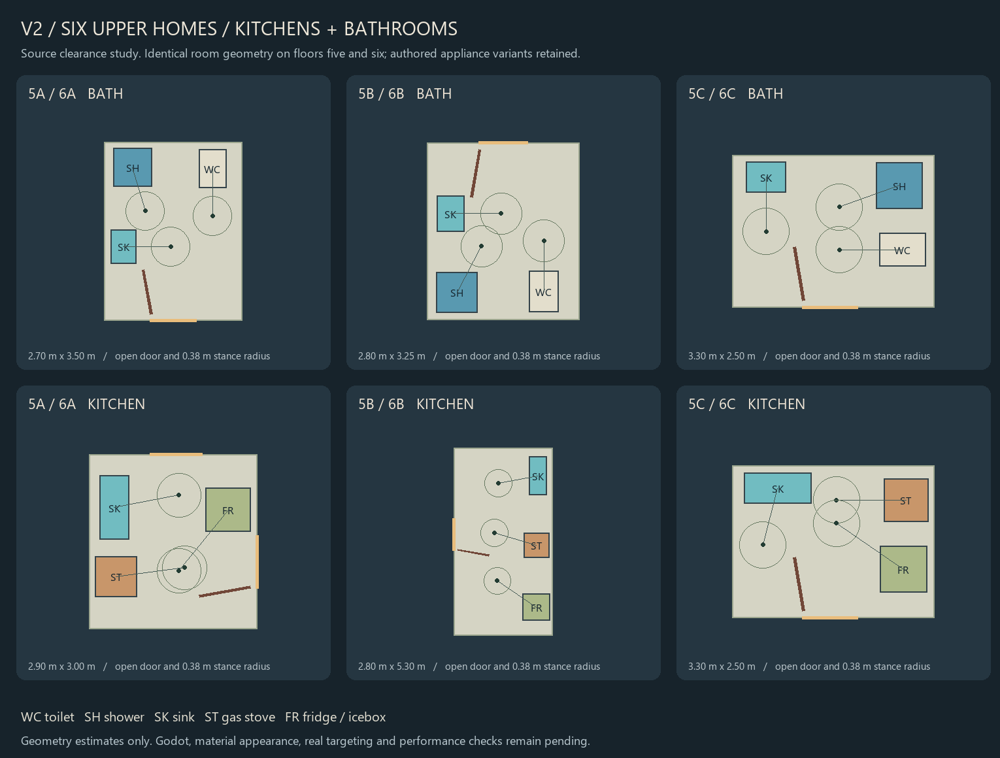

# Upper apartment sanitary and appliance batch

Base: `7fe366c`. Status: **source integrated; runtime pending**. Godot was not launched.

The batch installs the complete sanitary/appliance category across **5A, 5B, 5C, 6A, 6B and 6C**: six toilets, twelve sinks, six showers, six gas stoves, six fridges and six open kitchen sink stands. The restricted 5D and 6D rooms receive no domestic fixtures. V2 now has 107 domestic furniture records and 60 domestic fittings; the added stands/toilets contribute 2,544 triangles. This is not a total runtime rendering budget.

`work/v2_upper_fixtures_01/build.py` owns the additions. It extracts the existing toilet assembly without Blender and retains the original fitting identities and household properties. Cal's 5B and Mae's 6C retain electric monitor-top fridges; the other four retain oak/zinc iceboxes. Existing runtime consumers retain their material, water-control, appliance-animation and acoustic ownership. The runtime's existing tap discovery connects the eighteen additional water fittings to its single BoilerTend supply. Physical pipe routing and actual supply simulation remain unproved.

The A and B layouts use separated bathroom fixtures and perimeter kitchens. The compact C layouts put the shower and toilet on the east side and use an L-shaped kitchen. These arrangements leave a capsule route around the fully open room doors. The A fridge's operating position remains inside its kitchen; it does not require standing through the study doorway.

## Source checks

- Every original layout row/property, furniture record and fitting record is preserved. Eleven native owners/canon/material/selector files are unchanged. Both regenerated outputs match byte-for-byte.
- All 42 additions remain inside their room boundaries. No fixture footprints intersect, except the six named sink/stand support pairs. Toilet and support meshes use existing material keys and finite triangle data.
- All 6,030 room-door poses clear walls, chases and the new fixture envelopes. Radius 0.38 m plan routes reach all 42 occupied upper rooms, both stair arrivals on each floor and all 36 new fixture stances; route edges are resampled at 25 mm. Restricted rooms remain unreachable.
- 1,276 conservative appliance-motion samples cover fridge food leaves through 105 degrees, ice-leaf motion within that sweep, withdrawn icebox trays and the stove's open drop-down envelope. They clear other fixtures, room boundaries, fully open room doors and each appliance's own operating stance.
- Four deliberate faults are rejected: a toilet outside its room, two colliding fixtures, an obstructed stance, and a stance in a moving fridge leaf's path.
- Four GDScript syntax parses pass. The existing 56-setting persistence roster, heating, accessories, preparation cabinets and bathroom detail source checks pass. The older persistence preservation check now permits additive fixture records while still protecting all of its original records exactly.
- Official F05/F06 completeness still exits **2**: all eighteen queried obligations remain **PROGRAMMED**. No completeness tier was promoted.

Receipts and current inventory: `design/astra/work/v2_upper_fixtures_01/`. The prepared `OrisonV2UpperFixturesTest.tscn` checks two full runtime lifetimes, fixture types, solid bodies, supply/control ownership, fridge variants, active flush/water/animation teardown and acoustic restoration. It has not run. Existing upper-room floor probes still resolve to the same clear points after furnishing.

This drawing uses flat source colours, not game materials. Plan envelopes and pre-opened-door searches do not prove actual targeting, controller movement, sequential door operation, shower entry, material/voxel appearance, sound, lifecycle or performance. Those checks remain deferred under the user's no-Godot instruction.

Next: batch sleep, seating, storage, work furniture, accessories, room lighting and installed heat across these six homes; then the eight remaining numbered residential programs, B1 housing and shared/service scope. V2 remains incomplete, V1 remains default, and S2J remains open.
