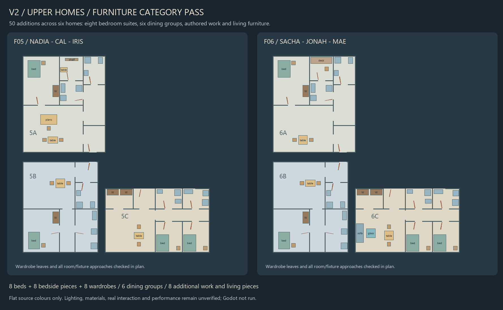

# Upper apartment furniture categories

Base: `c8908f2`. **Source integrated; runtime pending.** Godot and Blender were not launched.

Fifty pieces now populate 5A, 5B, 5C, 6A, 6B and 6C together:

- Eight beds, eight bedside stands and eight wardrobes, including the authored second bedrooms in 5C/6C. No new resident is implied.
- Six dining tables and twelve dining chairs. Household rectangular/round table, timber and bedding variants are retained.
- Nadia's drafting table, stool, plan shelf and model table; Sacha's authored work desk and chair; Mae's sofa and glass coffee table.

The batch adds 100 semantic anchors and 20,776 source triangles. V2's domestic furniture file now contains 157 records. These are source counts, not runtime draw-call or performance measurements.

`design/astra/work/v2_upper_furniture_01/build.py` owns extraction and placement. Existing runtime material and furniture consumers remain unchanged. Nadia's complete drafting assembly uses the existing static table consumer; its authored papers remain with the assembly. Sacha's desk preserves the three original top/support members and their open collision structure, rather than substituting a generic desk. Bedside glass and Mae's table retain the existing optical material path. Eight wardrobes reuse the native moving leaves, garments, timber variants, sound and teardown owner.

The smaller C-family bedrooms could not retain usable bedside routes with wardrobes open beside their beds. Both cabinets instead occupy the adjoining studio's back wall. This is clothing storage within the same apartment; resident work equipment remains to be integrated. The A-family meal groups stay away from the main entry, and Sacha's chair leaves a route around the study door.

## Evidence

The current batch check passes original-record/property preservation, unique anchors, material keys, finite mesh data and Sacha's three collision members. Nine native/canon/material/selector files are unchanged. A repeated generation reproduces the installed data byte-for-byte.

Geometry checks include all fifty additions and the prior forty-two fixture/support records. All 6,030 room-door sweep samples remain clear. All 2,960 wardrobe leaf poses through 92 degrees clear other furniture and their own operating stances. With wardrobes fully open, radius 0.38 m plan routes still reach all 42 occupied rooms, all 86 fixture/furniture approach points, and both stair arrivals per floor. Edge samples are 25 mm apart. The existing 1,276 appliance-motion checks also pass. The two restricted rooms remain excluded.

Four deliberate regressions are rejected: a bed outside its room, a bedside piece inside a bed, an obstructed bed approach, and a stance intersected by an opening wardrobe leaf. Four GDScript syntax parses and the existing persistence, heating, accessory, preparation-cabinet and bathroom-detail source checks pass. Upper room floor probes were regenerated to select clear positions after furnishing.

Official F05/F06 completeness still exits **2**, with eighteen obligations at **PROGRAMMED**. This packet promotes no runtime or acceptance tier.

The prepared `game/tests/OrisonV2UpperFurnitureTest.tscn` checks all fifty consumers, solid bodies, material bindings, eight native wardrobe mechanisms, Sacha's separate desk supports, and disposal during active wardrobe animation over two runtime lifetimes. It is **unrun**. Source receipts and current inventory are under `design/astra/work/v2_upper_furniture_01/`.

The image uses flat source colours. Plan routes use pre-opened room doors and do not prove actual input, sequential door operation, targeting, resident movement, materials, voxel shadows, listening or performance. Beds/chairs remain fixed furniture without new sleep/sitting mechanics; wardrobe positions are not newly persisted. V2 remains incomplete, V1 remains default, and S2J remains open.

Next categories: kitchen preparation/storage, accessories, resident-specific equipment and props, upper-room lighting and installed heat. Eight other numbered apartment programs, B1 housing and shared/service completion remain separate work.
