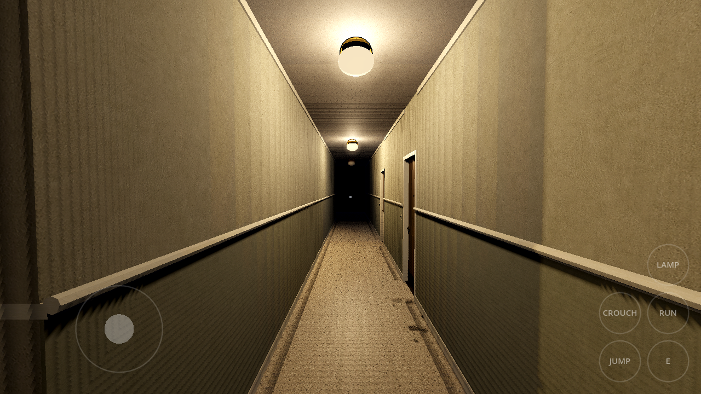
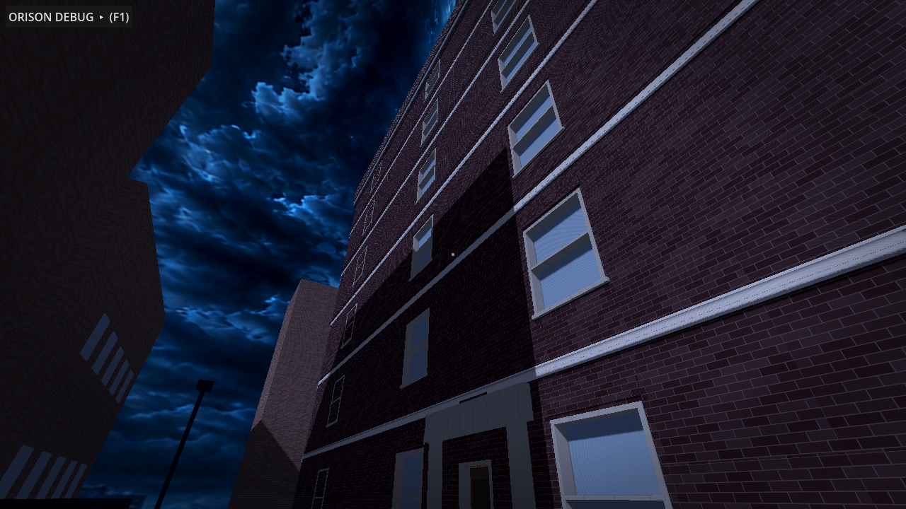
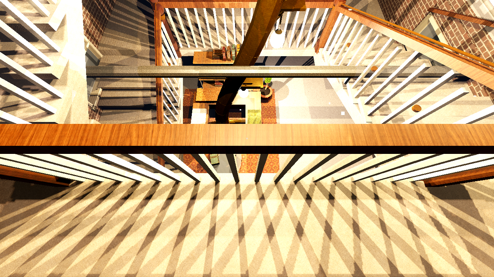

# Orison Apartments — Godot 4.5 Building Prototype

First-person navigable blockout of the full building, assembled from the
procedural art pipeline in `../art/` (see that README for regeneration).
Open this folder in Godot 4.5+ and press F5. You start in the lobby at
night.

## Controls

- **WASD** move · **Shift** run · **Space** jump · **C** crouch
- **Mouse** look (click to capture, **Esc** to release)
- **E** interact (elevator call buttons and cabin panel)
- **L** flashlight · **V** noclip · **F1** debug panel · **F2** intro

**Touch:** a phone HUD auto-enables on mobile — a virtual stick under the
left thumb (it appears wherever you press, so where your hand lands never
matters), drag anywhere on the right to look, and a thumb cluster for
interact, jump, run, crouch and the flashlight. **Run** latches, since it
is the one held action and pinning a thumb down to jog is miserable;
everything else is a tap that does what tapping the key does. Movement and
the buttons drive the same named actions the keyboard does, and the player
*polls* those actions rather than handling key events — an on-screen
button sets an action's state without ever producing an InputEvent, so
anything read from `_unhandled_input` is invisible to a thumb. Tick
**Touch controls** in the debug panel to drive it with a mouse on desktop.





## What is alive right now

**The atrium stair (new):** the whole light court is now one grand open
switchback stair, basement to roof, wrapped around a 2.9 m square open
eye — look up from the lobby deck and you see six storeys of balustrade
and the skylight; look down from the roof and you see the lobby runner.
Each climb is 20 risers (160 mm rise, 324 mm going): a wide west flight
off the floor-level south deck, a full-width north landing at the half
level, and an east flight arriving on the next deck. Every deck opens
south through a court-wall archway into the elevator hall, so corridor ->
hall -> atrium is the same move on every floor (basement included). The
roof is genuinely accessible: the stair tops out inside a glazed monitor
with a door onto the roof, capped by a steel-ribbed skylight. The old
front and service core stairs are gone; their wells are solid slab again,
the south core is the elevator hall, the north core is a per-floor
utility room (trash chute, meter bank, mop sink) — and the slab slivers
that used to show as gaps between floors on the upper stories are closed:
every court opening is now flush with the wall faces.

**Surface detail pass (new):** every plastered wall now carries a
baseboard and cornice; corridors, cores and the stairwell wear a
dado-height wainscot band with cap rail (the reference stairwell's green);
rooms get real floor finishes (terrazzo ring corridors and lobby, oak
boards in apartments, ceramic in bathrooms); door reveals and window
frames/sills/glazing as before; a cornice band crowns the facade, a portal
surrounds the street entry, and the basement ceiling runs visible heating
mains, risers and conduit.

**Stripped interior masonry:** interior partitions are now constructed as
brick substrate with separate plaster and wallpaper finish skins on both
faces. A deterministic irregular removal field exposes approximately 40%
of the masonry throughout the building; surviving paper covers only part
of the remaining plaster, so rooms range organically from faded wallpaper
to half-stripped renovation work. Exterior masonry receives the same finish
only on its room-facing side. Openings are subtracted before the skins are
built, collision remains on the simple substrate, and each finish is batched
once per floor rather than emitted as individual damage props.

**Building operations pass:** the Orison now advertises how it actually
works. Three low-overhead riveted fire-escape towers give the rear and side
elevations period egress silhouettes; the basement has a separate rear
service door, sunken concrete areaway, steps, drain and railings; the boiler
room carries feed equipment, inspection tags, chemical treatment and floor
drain evidence; the trash chute terminates at a compactor and rolling-bin
route; and court downspouts terminate at a grated sump. The lobby accumulated
an HPD/fire/inspection notice palimpsest and a visibly later intercom retrofit.
Apartment and service leaves carry closers in addition to their existing
hinges, peepholes, kick plates, locks and worn saddles.

**Lived-in apartments (new):** every occupied unit is furnished as its
resident's home — beds with mattress/blanket/pillow, sofas, dining sets,
book-filled shelves, kitchens with counters/uppers/stove/fridge, rugs,
plants and wall art, palette-varied per unit so no two households read the
same. The heroes keep their signature clusters on top (Mina's caption
station, Juno's amp-strewn studio, Omar's workshop, Rhea's booth, Nadia's
plan table, Sacha's capture wall); 3C stays stripped to studs with
buckets and sawhorses, 5D is charred with soot shadows, 6D is crate
storage, and the lobby, community room, laundry and storage cages are
dressed to match.

**The elevator works (new):** every landing has real center-parting steel
doors with vision windows, and they are the shaft interlock — while the car
is elsewhere its landing is sealed, so you cannot walk into an open well.
Brass call plates with lit buttons are mounted beside each opening, and the
cab carries its own floor-button panel. Pressing a call runs the full
sequence: doors close, the car travels (carrying anyone standing in it —
WalkTest rides it 19.6 m), the arrival bell strikes, the doors reopen.

**The light court rebuilt (new):** the stair's light was seven separate
globes on long drops down the eye, which read as seven unrelated fittings
rather than one idea. It is now a single fluted column standing the full
height of the court — basement floor to skylight — with the light built
into it: a glazed slot up each face and a lit brass collar at every
landing. The court also has a skylight to be lit *by*: the monitor was
open-topped, so a steel-ribbed glazed cap now closes it. The shaft of
light down the well was a round cone in a square well, spilling through
the balustrades at the corners and stopping short at both ends; it is a
square prism matched to the 2.92 m eye, running from the glazing to the
lobby floor.

Also fixed at the stair: the foot of every flight buried itself in the
floor it landed on (the waist slab runs 0.19 m below its own start
height), so the bottom treads read as sinking into the ground — each
flight now has a closer filling that wedge, the way a real bottom riser
sits on the slab. And the topmost landing had no balustrade along its
open edge, because the guard loop is driven by the climbs and the last
climb has no floor above it: that left a seven-storey drop with nothing
across it at roof level.

**Wayfinding and a working lift (new):** a storey numeral faces you as you
come off the stair and out of the lift on every floor, and every
apartment door has its number on the wall beside it. The lift cab now
carries one button per stop instead of a single plate that advanced to
the next floor — reaching B1 from F06 used to mean riding every landing
in between.

**The roof is a place (new):** a sheltered lounge deck on the lee side of
the monitor — boarded, with a pergola whose slats throw a ladder of
shadow, seating and string lights — and a tenants' garden along the north
and west parapets: raised beds, vegetables, bean canes, a water butt off
the tank overflow. Lit, so the roof door no longer opens onto a void.

**A city around it (new):** the block used to stop at ±20 m, so looking
down the pavement your eye ran straight out to open sky with the sky
dome's distant city sitting at the wrong elevation — the single loudest
tell that this was a set. The street wall now runs to ±58 m with masses at
irregular heights, closed at both ends as though the road bends behind
them, and a second, taller ring further out fills the band you could
otherwise see over from the roof. Sodium streetlamps actually light the
pavement now (they were geometry with nothing inside them), the road has a
centre line, and the block carries the clutter that makes a street read:
fire escapes, a traffic signal, bus shelter, phone booth, mailbox, news
boxes, parked cars down both kerbs, dumpsters, power spans and two water
towers on neighbouring roofs. Around 1,570 neighbour windows are lit as
data — one unshaded quad each, no lights — clustered by floor and mostly
dark, because a facade is not a switchboard.

**After the storm (new):** it has just stopped raining hard. Light
drizzle falls with a wind that gusts rather than blows steadily, and the
leaves it brought down are still coming. The road and pavement are wet —
darker and much smoother than dry, which is what makes a wet street read —
with puddles pooled along the gutter where a crowned road sends its water,
leaf litter drifted against the kerb and the building line, and what the
wind took down still lying where it fell: a branch across the pavement, a
bin on its side with its lid away from it, a folded-out umbrella in the
gutter.

Because the Compatibility renderer has no screen-space reflections, the
wet does not reflect on its own — a dark smooth puddle is just a dark
patch. So the reflections are *drawn*: an elongated additive smear under
every lamp and every neon sign, stretched down the pavement the way a real
reflection smears across ripples. One unlit quad per source, and it is
what sells the whole effect. Volumetric fog is likewise unavailable there,
so the drizzle is particles rather than a fog volume, re-centred on the
player each frame and suppressed indoors.

**Neon (new):** a projecting blade reading ORISON down the pavement in
pink, and the ground-floor druggist's sign flat on the wall in cyan. Both
are built from strokes of glass tube on a dark backing panel rather than a
lit billboard, which is what makes neon read as neon at a glancing angle.
The sign is a conductor body and the most receptive object on the building
(a tube with a failing transformer already stutters) — on the motif it
surges, and above 0.55 infection it drops whole letters for a fraction of
a second. Nobody has to be told that is wrong.

**Occupied at night (new):** from the sidewalk the Orison used to read as
derelict — lighting is gated to the storey you occupy, so five of its six
floors were black holes in a brick wall. Every exterior window now carries
an unshaded emissive quad just behind the glazing, single-sided and facing
out: it reads from the street, costs one draw, lights nothing, and is
invisible from inside (you see its culled back face and the real night
beyond, blinds and all). What a window shows is read from the room behind
it, so the building tells the truth about itself — 2D has been sealed
since 1927 and 5D burned, so they stay black; vacant 3C and the landlord's
crate store in 6D are unlit; kitchens run cooler than living rooms; and
about a third of the rest are dark because it is the middle of the night.

**Lighting that reads (new):** the rig gates fixtures by storey, then spends
a bounded working set on the nearest ones, weighting circulation fixtures
well above room fixtures. That second half matters because the GL
compatibility renderer caps lights *per object* and each floor's walls are a
single merged mesh — enabling a whole storey at once hands that cap to an
arbitrary subset, which is what used to leave a lit corridor black halfway
down. Corridor domes now throw their authored 7.2 m (an authored range
raises a circulation fixture's throw instead of only capping it) so
consecutive pools overlap to the far wall. The light court is exempt from
the storey gate entirely: it is one open volume seven floors tall, so from
the lobby deck you see — and are lit by — the pendants above you, and the
balustrades cast down the whole shaft.

**Personality density (new):** the six hero units are dressed down to
the object level from a 20-piece clutter assembly library (amps,
guitars, pedalboard, mic stands, reel deck, headphones, pinboards,
pegboard, parts trays with socketed valves, jar rows, camera tripod,
softboxes, cable coils, record crates, table radio, massing model,
papers, bookpiles, mugs, bottles) — Mina's cards are pinned in a
squared grid, Nadia's overlap three deep over loose taped sheets, and
her table carries a chipboard massing study of the Orison itself.
Eleven named supporting residents (teacher, night nurse, seamstress,
horticulturist, legal clerk, the Bell family, rental guests, radio
collector, painter, insomniac writer, estate collector) get compact
story clusters on their dining surfaces and wall piers, and every
occupied unit gets a deterministic lived-in surface pass (mugs, papers,
bookpiles on dining/coffee/desk tops). Wall boards mount flush on each
storey's true masonry face and hang on the pier between the windows.

**Parametric asset library (new):** every furniture piece and appliance is
now an original detailed model in the spirit of an iconic typology — see
`../art/docs/furniture_references.md` for the full design-reference table.
Bentwood-style café chairs with steam-bent hoop backs, pedestal dining
tables, spool beds with turned posts and spindles, armoires with raised
panels and brass knobs, steel-ladder shelving with individual jittered
books (one leaning per bay), Frankfurt-style flat-front kitchens with real
sinks and cross taps, enamel ranges with clock panels and bakelite knobs,
rounded-shoulder 1950s refrigerators with chrome pulls, porcelain pedestal
sinks and close-coupled toilets, and **a molded bakelite toggle switch on
both faces of all 94 doorways** (validated: switches = 2 × doors, every
occupied unit's bed/kitchen/bath/dining completeness and kitchen-trio
facing are asserted at generation time). The conductor props got the same
treatment: four-column cast-iron radiators with brass valve wheels,
porthole front-loader washers, articulated task lamps, batten fluorescents
with starter cans and pull chains, studio monitors with real cones,
ring-shroud floor fans, a riveted boiler with gauge and fire door, and
stile-and-rail door leaves with brass levers on rosettes.

**Complete apartment set (new):** every unit is modeled to its stack
archetype at the brief's real areas — A one-bedroom 74.9 m² (street), B
studio with sleeping alcove 56.8 m² (rear), C two-bedroom 85.7 m² (rear),
D one-bedroom + office 70.4 m² (street) — plus the locked "former suite"
storage room the 1927 subdivision stranded between A and B on each floor.
Unit states and resident identity are layered on: 2D is sealed (no
doorway at all), 3C stands vacant with exposed studs and debris, 5D is
fire-damaged, 6D is landlord crate storage, and the six hero apartments
carry their residents — Mina's ordered caption station (2A), Juno's
speaker-strewn studio (2C), Omar's workshop (3B), Rhea's vocal booth and
aligned playback pair (3D), Nadia's plan table (5A), Sacha's three-monitor
capture wall (6A). Speakers are a new conductor body: the cone thumps the
motif pitched low.

**Vertical slice (new):** apartment 4B is detailed to the brief's Section 4
plan — entry vestibule, bathroom, closet, galley kitchen, main room,
sleeping alcove, furniture — with its functional ensemble: the hero
**toaster** (full latch → coil → relay → pop cycle with 46 mm lever travel
and 4 mm overshoot; press E to run it; at infection > 0.4 its release
quantizes to the conductor), fridge compressor, twin monitors, box fan,
desk lamp, radiator under the rear window, and the **door anomaly** — a
door-shaped seam that only manifests above 0.75 infection, between the
workstation and the radiator.

**The Case Network at the desk:** interact (E) with the 4B workstation
chair to take whichever call is holding. Three cases are wired, and they
arrive in order — the desk prompt names the one waiting.

The console only ever offers three verbs: split a signal apart, hold a
piece of it, push that piece into the building. A case is what those verbs
*mean* tonight, which is why the third call can be about something as
personal as a woman's voice and still need no tutorial. The caller's
channel rides the same conductor clock the building follows, routing moves
the conductor's origin to a real acoustic-graph node, and every outcome
changes building state. One outcome per case, latched; Esc steps away and
the call continues without you. Saying nothing is always a real answer and
every case scores it as one.

| # | Caller | Resident | What it leaves behind |
|---|---|---|---|
| 4471 | Mara Chen — the speaker answers early | Mina Vale · 2A | Complete pushes infection to 0.85, which is what lets the door anomaly manifest |
| 4482 | Leon Price — footsteps in an empty unit | Omar Bell · 3B | A utility door in the F03 corridor that is not on the plans, whichever way you answer |
| 4496 | Briar Lane — her assistant has her voice | Rhea Sato · 3D | Matching the model exactly leaves it taking calls at *your* desk |

**Field phases.** Case 02's route through the heating riser ends somewhere
in the building, and its response window is long enough to go there. Leave
the desk mid-call — the call does not pause, and a banner follows you —
walk down to the third-floor west corridor, and standing where the route
ends answers the call with your feet. That is scored as a *different*
outcome from letting the window expire in the chair: one is going down to
meet it, the other is being waited out, and Omar has a different thing to
say about each. The place you have to stand is anchored to the door prop
itself, so it is exactly where the door then appears.

Cases are data (`scripts/call/case_library.gd`); `call_interface.gd` is
only the runner. A case is a list of beats — dialogue, delays, infection
moves, graph injections, and the two that touch the world, `reveal` and
`flag` — plus optional `field` and `window` keys for a case you can walk.
Adding a fourth case is a dictionary, not a class.

**Room 0 (new):** once the door anomaly is manifest, interact with the
seam to step through into the hidden room — a pocket space held open by
the building's infection, where the wall seams pulse with the motif
directly (no translation profile: the room *is* the motif). Leave by the
far seam, or let infection drop below 0.7 and the room collapses,
ejecting you into a very slightly incorrect apartment: the conductor's
tempo returns 0.8 BPM wrong, permanently.

**Networked propagation (new):** motif events no longer broadcast — they
are injected at an origin node (default: the basement boiler) and travel
`acoustic_graph.json` with per-node delays and damping. A knock reaches
Floor 5's radiator ~117 ms after Floor 2's; the sweep is audible if you
stand in the stairwell. Debug panel: toggle networked/global, switch
origin (boiler / 4B radiator / F04 corridor light).

- All eight levels (basement → roof) walkable: ring corridors, the atrium
  stair (physically climbable, ramp colliders, fall-guarded eye), the
  elevator (call it, ride it, B1–F6, arrival bell).
- **The unseen conductor** (`Conductor` autoload): BPM clock + the
  `incomplete_knock` motif loop. It *requests* events; props translate
  them through mechanical profiles (`data/prop_catalog.json`) — action
  rate limits, response latency, receptivity. Raise the Infection slider
  in the debug panel and stand in a corridor: radiators knock the motif,
  fluorescents dip on its accents, the basement boiler answers late and
  heavy, laundry drums thump. At 0 infection the building is just a
  building.
- 38 functional props spawned from the shared layout markers: 23
  radiators (every unit + lobby), corridor fluorescents, the 4B desk
  lamp, washers/dryers, the boiler.
- Acoustic graph (`data/acoustic_graph.json`, 40 nodes): heating risers
  H-A…H-D chaining radiators to the basement headers and boiler. Debug
  overlay draws the networks in 3D.
- Debug panel: floor teleports, BPM, infection, show-all-floors,
  acoustic overlay, mute, position/FPS.

## Tests

```bash
godot --headless --path game --import                       # first time
godot --headless --path game res://tests/WalkTest.tscn      # 124 checks
godot --headless --path game res://tests/LightingAudit.tscn # per-room light
godot --path game res://tests/Screenshot.tscn               # doc renders
godot --path game --resolution 2560x1440 res://tests/Perf.tscn
```

The last two must run windowed — a headless run renders nothing, which
would report as a pass.

### Intro / viral seed director

The debug panel now opens expanded. Press **F1** to collapse or reopen it,
then press **Play intro**. **F2** starts or stops it directly. The
30.35-second opening reverses the player's departure: it starts outside
looking back at Orison, hurries through the front door, crosses the lobby,
rides the lift to floor four, checks the corridor and apartment furtively,
and returns to the 4B workstation. The score builds throughout, cuts to
absolute silence at the desk, and leaves the building's diegetic machinery
audible beneath the monitor's **INCOMING CALL — M. CHEN** alert. The panel
reports the live low, mid, and high envelopes.

The seed is a reproducible mix of `Behind_The_Drywall.mp4` and
`The_Adjacent_Logic.mp4`. Its checked-in 20 Hz feature timeline drives the
building rather than relying on frame-dependent live FFT:

- sub energy transmits from the basement boiler into structure;
- low energy enters the 4B heating riser;
- midrange attacks enter the fourth-floor lighting circuit;
- high/air attacks enter monitors and speakers;
- stereo imbalance slightly detunes propagated responses.

Rebuild both the Ogg asset and feature map with:

```powershell
python art/audio/build_viral_seed.py `
  C:\path\Behind_The_Drywall.mp4 C:\path\The_Adjacent_Logic.mp4 `
  --audio-out game/assets/audio/viral_seed.ogg `
  --features-out game/data/viral_seed_features.json
```

WalkTest validates floor collision on every level, apartment slabs, prop
spawning, the conductor clock, a *physical* climb of the new dog-leg
F1→F2 by the real player capsule, elevator travel B1↔F6, acoustic graph
connectivity, the vertical slice, all three cases end-to-end, and Room 0.
Exit code = failure count.

**The lighting model (new):** 112 period fixtures across seven original
types — fabric drum pendants (living rooms), opal flush domes (bedrooms,
halls), milk-glass sconces over every bathroom mirror, enamel kitchen
linears, caged vapor-proof bulbs (basement/utility, they swing on motif
accents), a six-arm brass chandelier in the lobby, and long-drop globe
pendants down the atrium eye. Every fixture is a conductor body
(filament class: motif events surge the envelope and sway the drops).
Light quality is faked ray tracing on the compatibility renderer, by
design: a LightRig spends the light budget on the 14 nearest fixtures
(10 more at reduced energy, everything else keeps only its emissive
envelope + additive halo so it still reads as ON), the nearest six gain
a dim floor-tinted counter-light that fakes the first bounce, and the
three nearest eligible fixtures cast sticky, Compatibility-safe cubemap
shadows. Every fixture family participates, and a short distance cutoff
prevents lights in adjacent rooms from stealing the shadow budget. The
exterior moon casts tuned directional shadows, while the Blender build
bakes the rest of the GI impression into geometry: radial contact-shadow
quads under every furniture assembly and gradient AO strips along every
wall/floor junction. Environment retuned to match — lower flat ambient,
gentle depth fog, soft glow so bright sources bloom.

**Textured (new):** every mesh now carries deterministic world-projected
UVs and the full PBR texture pipeline — 24 texture sets (plaster, brick
families, oak, terrazzo, wainscot green, walnut, upholstery, aged enamel,
brushed steel, galvanized metal, bakelite and more) with albedo,
roughness and tangent normals, plus pre-composited stain/wear passes
(scuffed plaster, water-bloomed basement concrete, greasy appliance
enamel, rust-run utility metal, chipped wainscot). Floors export as
.gltf with one shared texture directory; see
`../art/textures/README.md` for the mapping and how to add a material.

## Performance

Measured, not asserted — run it windowed, since a headless run reports
zeroes for every rendering counter:

```bash
godot --path game --resolution 2560x1440 res://tests/Perf.tscn
```

It parks the camera at seven worst-case stations (the atrium eye sees seven
storeys at once; the street sees the whole block) and reports objects,
draw calls, primitives and frame time, failing any station over 16.6 ms —
or any station that renders nothing, which is a broken run rather than a
fast one. It also prints a census of where the geometry lives, because
optimizing the wrong half of that is effort spent for nothing. Set
`PERF_DIAG_ONLY=1` to decompose the F04 corridor into illumination,
shadow-caster and functional-prop submissions.

The August 2026 census found that RenderingServer's ~46,000 “objects” in
the F04 corridor were not 46,000 scene nodes. They were repeated render and
shadow submissions from 3,431 imported meshes and 5,035 prop meshes. All
471 marker-built props were root-owned, so hiding a floor never hid its
appliances or fixtures; the benchmark also moved its camera without making
that camera the streaming eye. Both are fixed. Closed rooms now render only
their active storey's shell and props; the open atrium and exterior retain
the views they genuinely need. On the project's RTX 4080 reference machine
the corridor fell from 65.54 ms / ~46,000 objects to 36.88 ms / 21,458,
while Harukiya reached 16.51 ms. Six of seven stations still miss the
16.6 ms target, so this is a measured recovery, not a declaration of 60 fps.

There is deliberately no box-occluder pass. The former wall-derived
occluders sat coincident with their own masonry and culled the facade,
window glazing and doorway sightlines. Storey visibility is the safe coarse
gate until a non-self-occluding interior solution is authored and rendered.

Props are modelled as heaps of primitives, and the census found one
outlier: the column radiator was 62 separate meshes, so 23 of them
carried over half of all prop geometry in the building.
`FunctionalProp.merge_static()` bakes a fixed sub-tree into one mesh per
finish — safe here because the knock shakes the radiator body as a unit,
so nothing inside it moves independently. Scene meshes fell from 3028 to
1682 with the triangle count unchanged. WalkTest guards it, since this
kind of cost is invisible until something profiles it.

## Geometry snapshot (furnished)

- Whole building: 325 meshes, ~225,500 triangles, ~16 MB geometry + 50 MB shared textures —
  still light for a full furnished building. Detailed furnishings render
  without collision; each assembly carries one invisible coarse hull for
  physics instead of trimesh furniture.
- 38 audio emitters, all procedural `AudioStreamWAV` (mono 22 kHz),
  synthesized at startup; no audio files on disk
- Floor streaming keeps one floor scene rendered in closed rooms (the whole
  stack renders in the atrium, where the eye is a sightline through every
  storey); exterior views retain the complete shell and F01's shop dressing

## Structure

```
scenes/building/orison_root.tscn   thin root; building_root.gd assembles
scripts/building/                  assembly, elevator
scripts/audio/                     conductor clock, acoustic graph, synth
scripts/props/                     FunctionalProp base + radiator, lamp,
                                   corridor light, washer, boiler
scripts/player/player_controller.gd
data/*.json                        copied from art/data (single source)
tests/                             WalkTest, Screenshot drivers
docs/screenshots/                  rendered from the real build
```

## Screenshots





## Android

An APK builds. One command, about a minute:

```bash
godot --headless --path game --export-debug "Android" build/android/orison.apk
```

141.7 MB, `com.orison.apartments`, arm64-v8a, minSdk 24 / targetSdk 36,
debug-signed and `apksigner`-verified. `export_presets.cfg` is committed;
build output is gitignored.

**Toolchain, if setting up a fresh machine.** Godot 4.7.1 export templates
into `%APPDATA%/Godot/export_templates/4.7.1.stable/`, and an Android SDK
with `platform-tools`, `build-tools;36.1.0` and `platforms;android-36` —
those versions are not a guess, they are what `android_source.zip` inside
the templates declares in its `config.gradle`. JDK 17. Then point
`Editor Settings > Export > Android` at the SDK, the JDK and a debug
keystore. Android also refuses to export unless
`rendering/textures/vram_compression/import_etc2_astc` is on, which is in
`project.godot` — it is what mobile wants anyway, since those GPUs sample
ETC2/ASTC natively.

**What the first build taught us.** The initial APK was 201 MB, and 59 MB
of that was four 4K sky panoramas the game never loads — only
`orison_half_dome_night_4k.png` is referenced, by a runtime string, which
is also why Godot's dependency-based export filters cannot see it. They
are excluded by name in the preset. If you add a sky texture and reference
it dynamically, add it to the preset's `exclude_filter` allowlist logic or
it will be excluded by pattern.

**Tuning the light budget on device.** The mobile budget starts at 12
lights / 4 shadow casters against the desktop 14 / 8. The first values (8
and 1) were reasoned about rather than measured and read flat and half-lit
on real hardware — one caster is not enough shadow to model a room. The
debug panel carries **Light budget** and **Shadow budget** sliders next to
the frame counter, so the ceiling can be found by pushing them until the
fps gives, on the phone in your hand. If you settle on values, move them
into `SHADOW_N_MOBILE` / `ACTIVE_N_MOBILE` in `light_rig.gd`.

**Not yet proven: whether it RUNS well.** It has never been on a phone.
The desktop build sits at 112-161 fps on an RTX 4080 at 1440p, which
sounds like margin and is not — a phone GPU is a different class of
machine, not a slower one. `LightRig` already drops to one shadow caster
and eight live lights on mobile (`SHADOW_N_MOBILE`, `ACTIVE_N_MOBILE`),
because an omni's cube shadow costs six passes over the visible set.
Still unmeasured: the atrium eye, which renders seven storeys at once and
is the worst case by a wide margin. `Perf.tscn` runs on-device exactly as
it does on desktop, and those numbers are the only ones worth trusting.

## Known limitations

See `../art/README.md` — additionally, night lighting is deliberately low
(the flashlight is a real tool indoors), and the elevator is still a
single-car system with no queue: a call while it is travelling is ignored
rather than remembered.
