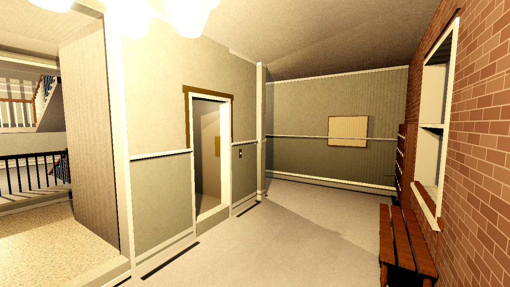
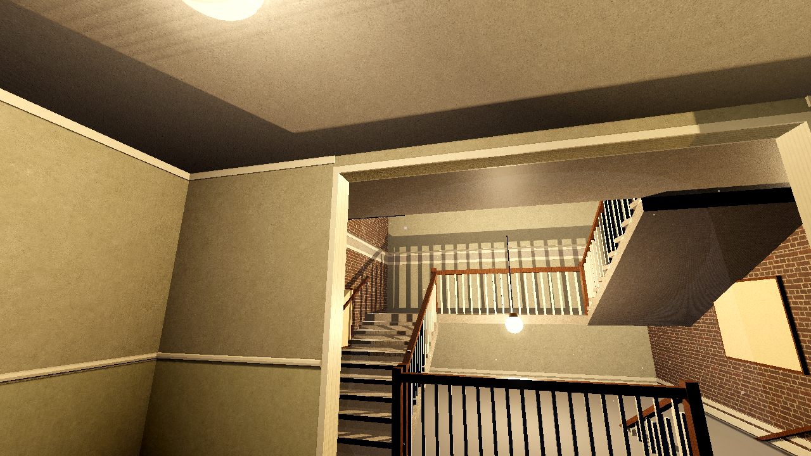
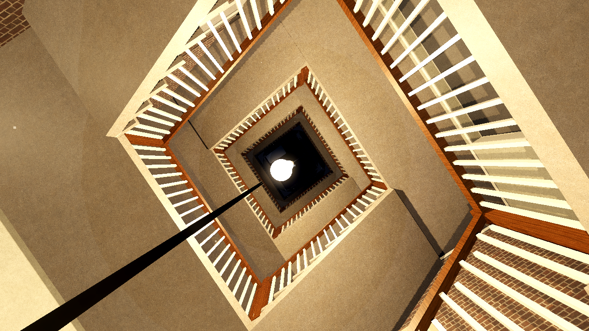
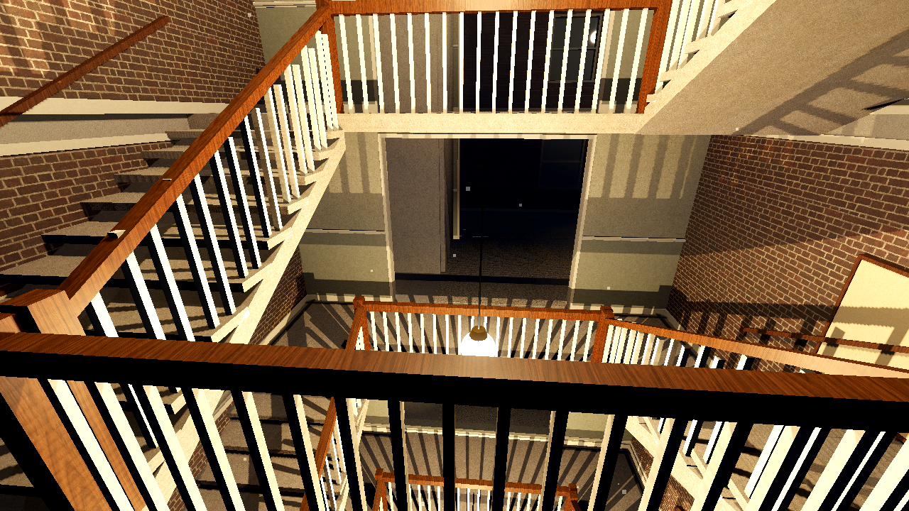
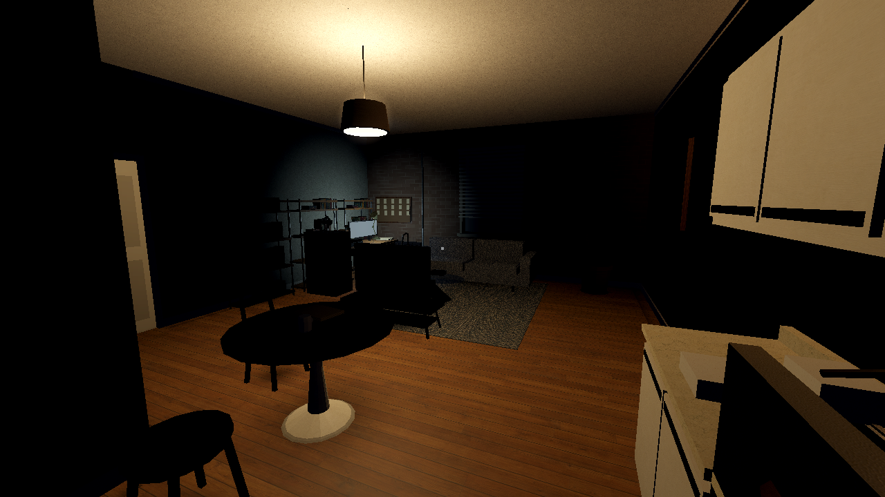
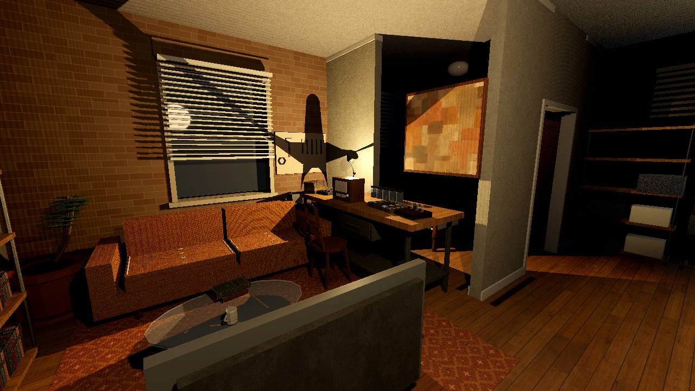
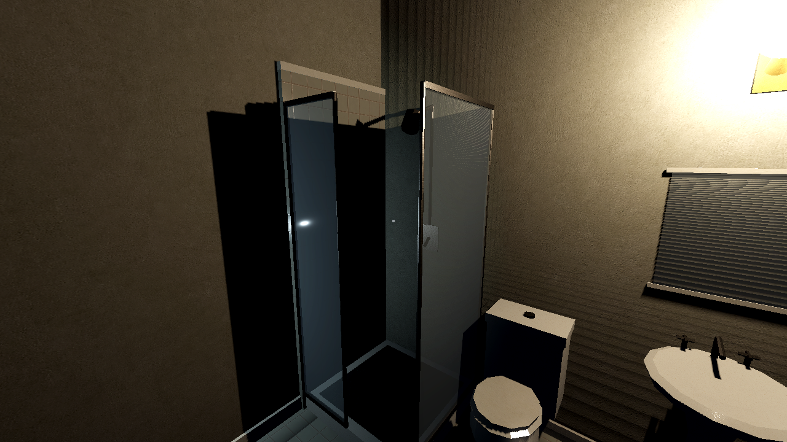
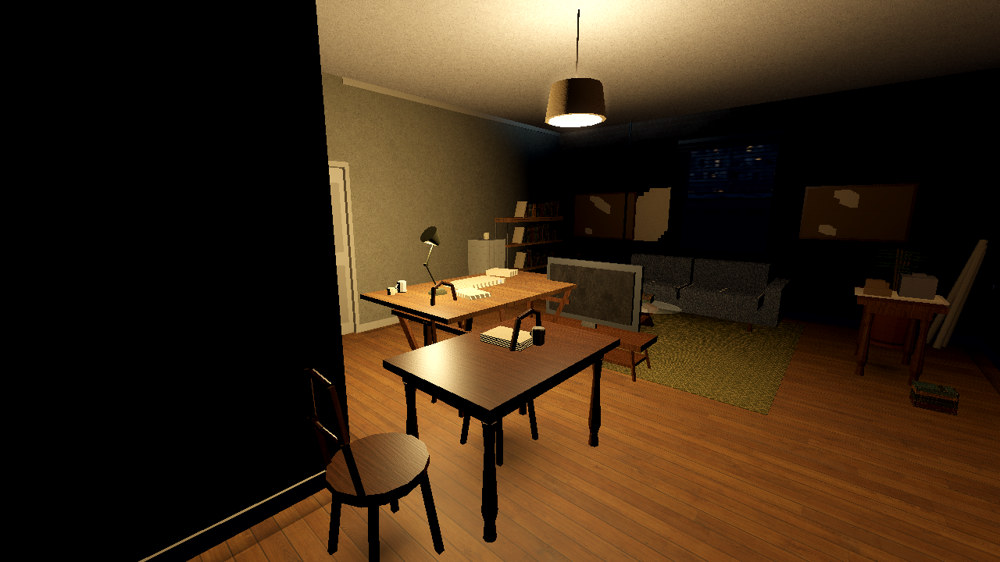
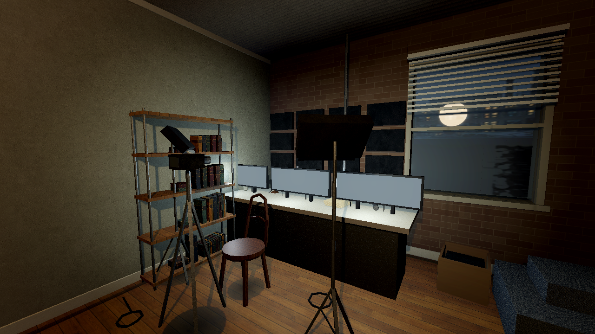

# Orison Apartments — Godot 4.5 Building Prototype

First-person navigable blockout of the full building, assembled from the
procedural art pipeline in `../art/` (see that README for regeneration).
Open this folder in Godot 4.5+ and press F5. You start in the lobby at
night.

## Controls

- **WASD** move · **Shift** run · **Space** jump · **C** crouch
- **Mouse** look (click to capture, **Esc** to release)
- **E** interact (elevator call buttons and cabin panel)
- **L** flashlight · **V** noclip · **F1** debug panel · **F2** intro

## What is alive right now

**The atrium stair (new):** the whole light court is now one grand open
switchback stair, basement to roof, wrapped around a 2.9 m square open
eye — look up from the lobby deck and you see six storeys of balustrade
and the skylight; look down from the roof and you see the lobby runner.
Each climb is 20 risers (160 mm rise, 324 mm going): a wide west flight
off the floor-level south deck, a full-width north landing at the half
level, and an east flight arriving on the next deck. Every deck opens
south through a court-wall archway into the elevator hall, so corridor ->
hall -> atrium is the same move on every floor (basement included). The
roof is genuinely accessible: the stair tops out inside a glazed monitor
with a door onto the roof, capped by a steel-ribbed skylight. The old
front and service core stairs are gone; their wells are solid slab again,
the south core is the elevator hall, the north core is a per-floor
utility room (trash chute, meter bank, mop sink) — and the slab slivers
that used to show as gaps between floors on the upper stories are closed:
every court opening is now flush with the wall faces.

**Surface detail pass (new):** every plastered wall now carries a
baseboard and cornice; corridors, cores and the stairwell wear a
dado-height wainscot band with cap rail (the reference stairwell's green);
rooms get real floor finishes (terrazzo ring corridors and lobby, oak
boards in apartments, ceramic in bathrooms); door reveals and window
frames/sills/glazing as before; a cornice band crowns the facade, a portal
surrounds the street entry, and the basement ceiling runs visible heating
mains, risers and conduit.

**Lived-in apartments (new):** every occupied unit is furnished as its
resident's home — beds with mattress/blanket/pillow, sofas, dining sets,
book-filled shelves, kitchens with counters/uppers/stove/fridge, rugs,
plants and wall art, palette-varied per unit so no two households read the
same. The heroes keep their signature clusters on top (Mina's caption
station, Juno's amp-strewn studio, Omar's workshop, Rhea's booth, Nadia's
plan table, Sacha's capture wall); 3C stays stripped to studs with
buckets and sawhorses, 5D is charred with soot shadows, 6D is crate
storage, and the lobby, community room, laundry and storage cages are
dressed to match.

**The elevator works (new):** every landing has real center-parting steel
doors with vision windows, and they are the shaft interlock — while the car
is elsewhere its landing is sealed, so you cannot walk into an open well.
Brass call plates with lit buttons are mounted beside each opening, and the
cab carries its own floor-button panel. Pressing a call runs the full
sequence: doors close, the car travels (carrying anyone standing in it —
WalkTest rides it 19.6 m), the arrival bell strikes, the doors reopen.

**Occupied at night (new):** from the sidewalk the Orison used to read as
derelict — lighting is gated to the storey you occupy, so five of its six
floors were black holes in a brick wall. Every exterior window now carries
an unshaded emissive quad just behind the glazing, single-sided and facing
out: it reads from the street, costs one draw, lights nothing, and is
invisible from inside (you see its culled back face and the real night
beyond, blinds and all). What a window shows is read from the room behind
it, so the building tells the truth about itself — 2D has been sealed
since 1927 and 5D burned, so they stay black; vacant 3C and the landlord's
crate store in 6D are unlit; kitchens run cooler than living rooms; and
about a third of the rest are dark because it is the middle of the night.

**Lighting that reads (new):** the rig gates fixtures by storey, then spends
a bounded working set on the nearest ones, weighting circulation fixtures
well above room fixtures. That second half matters because the GL
compatibility renderer caps lights *per object* and each floor's walls are a
single merged mesh — enabling a whole storey at once hands that cap to an
arbitrary subset, which is what used to leave a lit corridor black halfway
down. Corridor domes now throw their authored 7.2 m (an authored range
raises a circulation fixture's throw instead of only capping it) so
consecutive pools overlap to the far wall. The light court is exempt from
the storey gate entirely: it is one open volume seven floors tall, so from
the lobby deck you see — and are lit by — the pendants above you, and the
balustrades cast down the whole shaft.

**Personality density (new):** the six hero units are dressed down to
the object level from a 20-piece clutter assembly library (amps,
guitars, pedalboard, mic stands, reel deck, headphones, pinboards,
pegboard, parts trays with socketed valves, jar rows, camera tripod,
softboxes, cable coils, record crates, table radio, massing model,
papers, bookpiles, mugs, bottles) — Mina's cards are pinned in a
squared grid, Nadia's overlap three deep over loose taped sheets, and
her table carries a chipboard massing study of the Orison itself.
Eleven named supporting residents (teacher, night nurse, seamstress,
horticulturist, legal clerk, the Bell family, rental guests, radio
collector, painter, insomniac writer, estate collector) get compact
story clusters on their dining surfaces and wall piers, and every
occupied unit gets a deterministic lived-in surface pass (mugs, papers,
bookpiles on dining/coffee/desk tops). Wall boards mount flush on each
storey's true masonry face and hang on the pier between the windows.

**Parametric asset library (new):** every furniture piece and appliance is
now an original detailed model in the spirit of an iconic typology — see
`../art/docs/furniture_references.md` for the full design-reference table.
Bentwood-style café chairs with steam-bent hoop backs, pedestal dining
tables, spool beds with turned posts and spindles, armoires with raised
panels and brass knobs, steel-ladder shelving with individual jittered
books (one leaning per bay), Frankfurt-style flat-front kitchens with real
sinks and cross taps, enamel ranges with clock panels and bakelite knobs,
rounded-shoulder 1950s refrigerators with chrome pulls, porcelain pedestal
sinks and close-coupled toilets, and **a molded bakelite toggle switch on
both faces of all 94 doorways** (validated: switches = 2 × doors, every
occupied unit's bed/kitchen/bath/dining completeness and kitchen-trio
facing are asserted at generation time). The conductor props got the same
treatment: four-column cast-iron radiators with brass valve wheels,
porthole front-loader washers, articulated task lamps, batten fluorescents
with starter cans and pull chains, studio monitors with real cones,
ring-shroud floor fans, a riveted boiler with gauge and fire door, and
stile-and-rail door leaves with brass levers on rosettes.

**Complete apartment set (new):** every unit is modeled to its stack
archetype at the brief's real areas — A one-bedroom 74.9 m² (street), B
studio with sleeping alcove 56.8 m² (rear), C two-bedroom 85.7 m² (rear),
D one-bedroom + office 70.4 m² (street) — plus the locked "former suite"
storage room the 1927 subdivision stranded between A and B on each floor.
Unit states and resident identity are layered on: 2D is sealed (no
doorway at all), 3C stands vacant with exposed studs and debris, 5D is
fire-damaged, 6D is landlord crate storage, and the six hero apartments
carry their residents — Mina's ordered caption station (2A), Juno's
speaker-strewn studio (2C), Omar's workshop (3B), Rhea's vocal booth and
aligned playback pair (3D), Nadia's plan table (5A), Sacha's three-monitor
capture wall (6A). Speakers are a new conductor body: the cone thumps the
motif pitched low.

**Vertical slice (new):** apartment 4B is detailed to the brief's Section 4
plan — entry vestibule, bathroom, closet, galley kitchen, main room,
sleeping alcove, furniture — with its functional ensemble: the hero
**toaster** (full latch → coil → relay → pop cycle with 46 mm lever travel
and 4 mm overshoot; press E to run it; at infection > 0.4 its release
quantizes to the conductor), fridge compressor, twin monitors, box fan,
desk lamp, radiator under the rear window, and the **door anomaly** — a
door-shaped seam that only manifests above 0.75 infection, between the
workstation and the radiator.

**Case 01 at the desk (new):** interact (E) with the 4B workstation chair
to take Mara Chen's support call — a compact in-world port of the Audio
Virus prototype loop. Her breathing rides the same conductor clock the
building follows; isolating and capturing reveal the four-mark timeline
with its empty fifth slot; routing the loop moves the conductor's origin
to the desk so the building hears it through the electrical network; and
the three responses change real building state — Complete pushes
infection to 0.85, which is what lets the door anomaly manifest in the
wall. One outcome per case, latched. Esc steps away; the call continues.

**Room 0 (new):** once the door anomaly is manifest, interact with the
seam to step through into the hidden room — a pocket space held open by
the building's infection, where the wall seams pulse with the motif
directly (no translation profile: the room *is* the motif). Leave by the
far seam, or let infection drop below 0.7 and the room collapses,
ejecting you into a very slightly incorrect apartment: the conductor's
tempo returns 0.8 BPM wrong, permanently.

**Networked propagation (new):** motif events no longer broadcast — they
are injected at an origin node (default: the basement boiler) and travel
`acoustic_graph.json` with per-node delays and damping. A knock reaches
Floor 5's radiator ~117 ms after Floor 2's; the sweep is audible if you
stand in the stairwell. Debug panel: toggle networked/global, switch
origin (boiler / 4B radiator / F04 corridor light).

- All eight levels (basement → roof) walkable: ring corridors, the atrium
  stair (physically climbable, ramp colliders, fall-guarded eye), the
  elevator (call it, ride it, B1–F6, arrival bell).
- **The unseen conductor** (`Conductor` autoload): BPM clock + the
  `incomplete_knock` motif loop. It *requests* events; props translate
  them through mechanical profiles (`data/prop_catalog.json`) — action
  rate limits, response latency, receptivity. Raise the Infection slider
  in the debug panel and stand in a corridor: radiators knock the motif,
  fluorescents dip on its accents, the basement boiler answers late and
  heavy, laundry drums thump. At 0 infection the building is just a
  building.
- 38 functional props spawned from the shared layout markers: 23
  radiators (every unit + lobby), corridor fluorescents, the 4B desk
  lamp, washers/dryers, the boiler.
- Acoustic graph (`data/acoustic_graph.json`, 40 nodes): heating risers
  H-A…H-D chaining radiators to the basement headers and boiler. Debug
  overlay draws the networks in 3D.
- Debug panel: floor teleports, BPM, infection, show-all-floors,
  acoustic overlay, mute, position/FPS.

## Tests

```bash
godot --headless --path game --import                       # first time
godot --headless --path game res://tests/WalkTest.tscn      # 106 checks
godot --headless --path game res://tests/LightingAudit.tscn # per-room light
godot --path game res://tests/Screenshot.tscn               # doc renders
godot --path game --resolution 2560x1440 res://tests/Perf.tscn
```

The last two must run windowed — a headless run renders nothing, which
would report as a pass.

### Intro / viral seed director

The debug panel now opens expanded. Press **F1** to collapse or reopen it,
then press **Play intro**. **F2** starts or stops it directly. The
30.35-second opening reverses the player's departure: it starts outside
looking back at Orison, hurries through the front door, crosses the lobby,
rides the lift to floor four, checks the corridor and apartment furtively,
and returns to the 4B workstation. The score builds throughout, cuts to
absolute silence at the desk, and leaves the building's diegetic machinery
audible beneath the monitor's **INCOMING CALL — M. CHEN** alert. The panel
reports the live low, mid, and high envelopes.

The seed is a reproducible mix of `Behind_The_Drywall.mp4` and
`The_Adjacent_Logic.mp4`. Its checked-in 20 Hz feature timeline drives the
building rather than relying on frame-dependent live FFT:

- sub energy transmits from the basement boiler into structure;
- low energy enters the 4B heating riser;
- midrange attacks enter the fourth-floor lighting circuit;
- high/air attacks enter monitors and speakers;
- stereo imbalance slightly detunes propagated responses.

Rebuild both the Ogg asset and feature map with:

```powershell
python art/audio/build_viral_seed.py `
  C:\path\Behind_The_Drywall.mp4 C:\path\The_Adjacent_Logic.mp4 `
  --audio-out game/assets/audio/viral_seed.ogg `
  --features-out game/data/viral_seed_features.json
```

WalkTest validates floor collision on every level, apartment slabs, prop
spawning, the conductor clock, a *physical* climb of the new dog-leg
F1→F2 by the real player capsule, elevator travel B1↔F6, acoustic graph
connectivity, the vertical slice, Case 01 end-to-end, and Room 0.
Exit code = failure count.

**The lighting model (new):** 112 period fixtures across seven original
types — fabric drum pendants (living rooms), opal flush domes (bedrooms,
halls), milk-glass sconces over every bathroom mirror, enamel kitchen
linears, caged vapor-proof bulbs (basement/utility, they swing on motif
accents), a six-arm brass chandelier in the lobby, and long-drop globe
pendants down the atrium eye. Every fixture is a conductor body
(filament class: motif events surge the envelope and sway the drops).
Light quality is faked ray tracing on the compatibility renderer, by
design: a LightRig spends the light budget on the 14 nearest fixtures
(10 more at reduced energy, everything else keeps only its emissive
envelope + additive halo so it still reads as ON), the nearest six gain
a dim floor-tinted counter-light that fakes the first bounce, and the
three nearest eligible fixtures cast sticky, Compatibility-safe cubemap
shadows. Every fixture family participates, and a short distance cutoff
prevents lights in adjacent rooms from stealing the shadow budget. The
exterior moon casts tuned directional shadows, while the Blender build
bakes the rest of the GI impression into geometry: radial contact-shadow
quads under every furniture assembly and gradient AO strips along every
wall/floor junction. Environment retuned to match — lower flat ambient,
gentle depth fog, soft glow so bright sources bloom.

**Textured (new):** every mesh now carries deterministic world-projected
UVs and the full PBR texture pipeline — 24 texture sets (plaster, brick
families, oak, terrazzo, wainscot green, walnut, upholstery, aged enamel,
brushed steel, galvanized metal, bakelite and more) with albedo,
roughness and tangent normals, plus pre-composited stain/wear passes
(scuffed plaster, water-bloomed basement concrete, greasy appliance
enamel, rust-run utility metal, chipped wainscot). Floors export as
.gltf with one shared texture directory; see
`../art/textures/README.md` for the mapping and how to add a material.

## Performance

Measured, not asserted — run it windowed, since a headless run reports
zeroes for every rendering counter:

```bash
godot --path game --resolution 2560x1440 res://tests/Perf.tscn
```

It parks the camera at six worst-case stations (the atrium eye sees seven
storeys at once; the street sees the whole block) and reports objects,
draw calls, primitives and frame time, failing any station over 16.6 ms —
or any station that renders nothing, which is a broken run rather than a
fast one. It also prints a census of where the geometry lives, because
optimizing the wrong half of that is effort spent for nothing. On an RTX
4080 at 1440p every station currently sits between 112 and 161 fps.

Two things pay for that. Shadows are budgeted separately from light and
much more tightly: an omni's shadow is a cube, so each caster re-renders
the visible set six times, and the nearest eight casters carry all the
modelling an eye can actually find. And 923 box occluders are built at
load from the same wall and slab data the geometry comes from, cut around
every door and window — so the facade stops the renderer drawing four
storeys of furniture behind it, without a doorway ever culling the room
you can see through it.

Props are modelled as heaps of primitives, and the census found one
outlier: the column radiator was 62 separate meshes, so 23 of them
carried over half of all prop geometry in the building.
`FunctionalProp.merge_static()` bakes a fixed sub-tree into one mesh per
finish — safe here because the knock shakes the radiator body as a unit,
so nothing inside it moves independently. Scene meshes fell from 3028 to
1682 with the triangle count unchanged. WalkTest guards it, since this
kind of cost is invisible until something profiles it.

## Geometry snapshot (furnished)

- Whole building: 325 meshes, ~225,500 triangles, ~16 MB geometry + 50 MB shared textures —
  still light for a full furnished building. Detailed furnishings render
  without collision; each assembly carries one invisible coarse hull for
  physics instead of trimesh furniture.
- 38 audio emitters, all procedural `AudioStreamWAV` (mono 22 kHz),
  synthesized at startup; no audio files on disk
- Floor streaming keeps ≤3 floor scenes rendered while walking (the whole
  stack renders in the atrium, where the eye is a sightline through every
  storey), and 923 generated occluders cull what the masonry hides

## Structure

```
scenes/building/orison_root.tscn   thin root; building_root.gd assembles
scripts/building/                  assembly, elevator
scripts/audio/                     conductor clock, acoustic graph, synth
scripts/props/                     FunctionalProp base + radiator, lamp,
                                   corridor light, washer, boiler
scripts/player/player_controller.gd
data/*.json                        copied from art/data (single source)
tests/                             WalkTest, Screenshot drivers
docs/screenshots/                  rendered from the real build
```

## Screenshots














## Known limitations

See `../art/README.md` — additionally, night lighting is deliberately low
(the flashlight is a real tool indoors), and the elevator is still a
single-car system with no queue: a call while it is travelling is ignored
rather than remembered.
