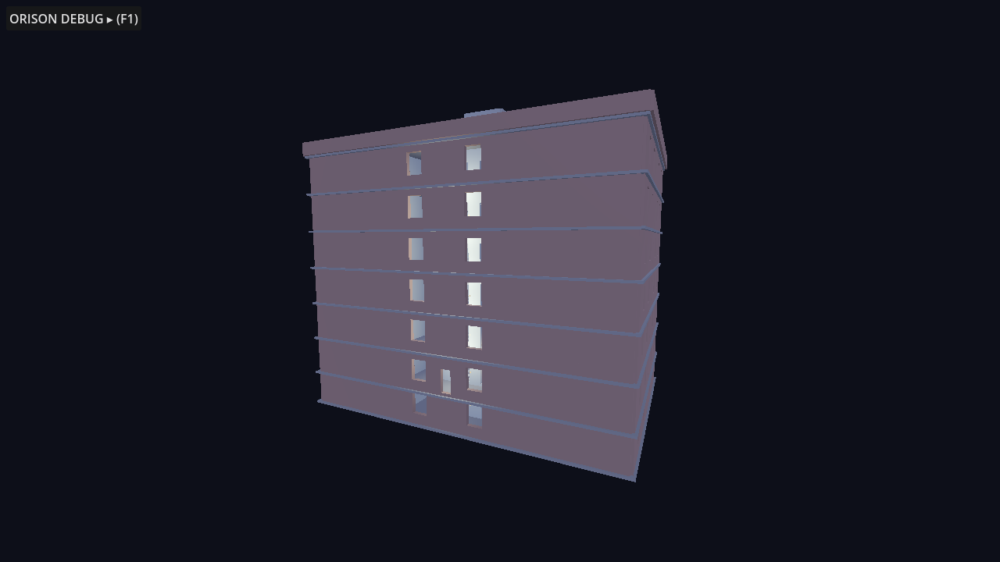
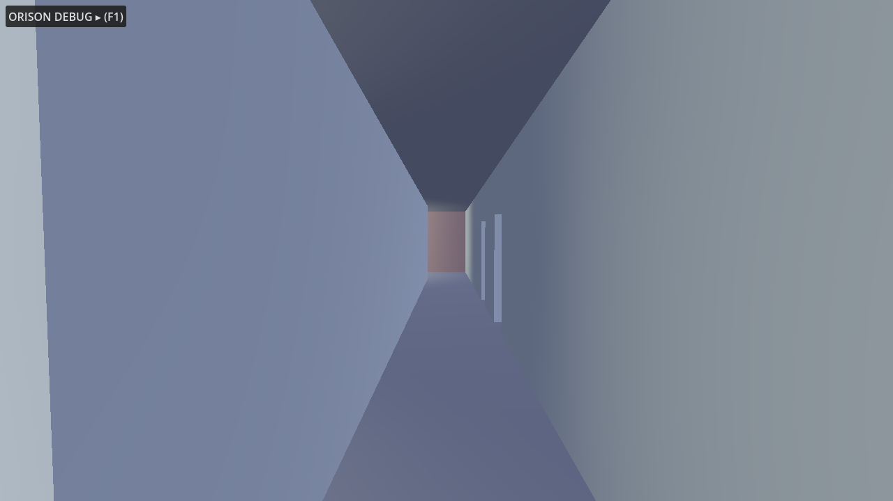
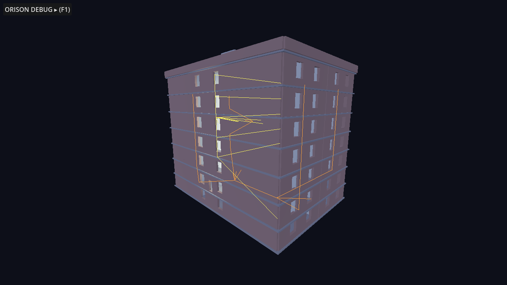

# Orison Apartments — Godot 4.5 Building Prototype

First-person navigable blockout of the full building, assembled from the
procedural art pipeline in `../art/` (see that README for regeneration).
Open this folder in Godot 4.5+ and press F5. You start in the lobby at
night.

## Controls

- **WASD** move · **Shift** run · **Space** jump · **C** crouch
- **Mouse** look (click to capture, **Esc** to release)
- **E** interact (elevator call buttons and cabin panel)
- **L** flashlight · **V** noclip (debug) · **F1** debug panel

## What is alive right now

**Vertical slice (new):** apartment 4B is detailed to the brief's Section 4
plan — entry vestibule, bathroom, closet, galley kitchen, main room,
sleeping alcove, furniture — with its functional ensemble: the hero
**toaster** (full latch → coil → relay → pop cycle with 46 mm lever travel
and 4 mm overshoot; press E to run it; at infection > 0.4 its release
quantizes to the conductor), fridge compressor, twin monitors, box fan,
desk lamp, radiator under the rear window, and the **door anomaly** — a
door-shaped seam that only manifests above 0.75 infection, between the
workstation and the radiator.

**Case 01 at the desk (new):** interact (E) with the 4B workstation chair
to take Mara Chen's support call — a compact in-world port of the Audio
Virus prototype loop. Her breathing rides the same conductor clock the
building follows; isolating and capturing reveal the four-mark timeline
with its empty fifth slot; routing the loop moves the conductor's origin
to the desk so the building hears it through the electrical network; and
the three responses change real building state — Complete pushes
infection to 0.85, which is what lets the door anomaly manifest in the
wall. One outcome per case, latched. Esc steps away; the call continues.

**Room 0 (new):** once the door anomaly is manifest, interact with the
seam to step through into the hidden room — a pocket space held open by
the building's infection, where the wall seams pulse with the motif
directly (no translation profile: the room *is* the motif). Leave by the
far seam, or let infection drop below 0.7 and the room collapses,
ejecting you into a very slightly incorrect apartment: the conductor's
tempo returns 0.8 BPM wrong, permanently.

**Networked propagation (new):** motif events no longer broadcast — they
are injected at an origin node (default: the basement boiler) and travel
`acoustic_graph.json` with per-node delays and damping. A knock reaches
Floor 5's radiator ~117 ms after Floor 2's; the sweep is audible if you
stand in the stairwell. Debug panel: toggle networked/global, switch
origin (boiler / 4B radiator / F04 corridor light).

- All eight levels (basement → roof) walkable: ring corridors, front and
  service stairs (physically climbable, ramp colliders), the elevator
  (call it, ride it, B1–F6, arrival bell).
- **The unseen conductor** (`Conductor` autoload): BPM clock + the
  `incomplete_knock` motif loop. It *requests* events; props translate
  them through mechanical profiles (`data/prop_catalog.json`) — action
  rate limits, response latency, receptivity. Raise the Infection slider
  in the debug panel and stand in a corridor: radiators knock the motif,
  fluorescents dip on its accents, the basement boiler answers late and
  heavy, laundry drums thump. At 0 infection the building is just a
  building.
- 38 functional props spawned from the shared layout markers: 23
  radiators (every unit + lobby), corridor fluorescents, the 4B desk
  lamp, washers/dryers, the boiler.
- Acoustic graph (`data/acoustic_graph.json`, 40 nodes): heating risers
  H-A…H-D chaining radiators to the basement headers and boiler. Debug
  overlay draws the networks in 3D.
- Debug panel: floor teleports, BPM, infection, show-all-floors,
  acoustic overlay, mute, position/FPS.

## Tests

```bash
godot --headless --path game --import                     # first time
godot --headless --path game res://tests/WalkTest.tscn    # 18 checks
xvfb-run godot --path game res://tests/Screenshot.tscn    # doc renders
```

WalkTest validates floor collision on every level, apartment slabs, prop
spawning, the conductor clock, a *physical* stair climb F1→F2 by the real
player capsule, elevator travel B1↔F6, and acoustic graph connectivity.
Exit code = failure count.

## Performance snapshot (blockout)

- Whole building: 46 meshes, ~15,060 triangles, ~850 KB glTF total
  (per floor: B1 1.5k · F1 2.1k · F2–F5 2.3k · F6 2.0k · roof 0.4k tris)
- 38 audio emitters, all procedural `AudioStreamWAV` (mono 22 kHz),
  synthesized at startup; no audio files on disk
- Coarse floor visibility keeps ≤3 floor scenes rendered while walking

## Structure

```
scenes/building/orison_root.tscn   thin root; building_root.gd assembles
scripts/building/                  assembly, elevator
scripts/audio/                     conductor clock, acoustic graph, synth
scripts/props/                     FunctionalProp base + radiator, lamp,
                                   corridor light, washer, boiler
scripts/player/player_controller.gd
data/*.json                        copied from art/data (single source)
tests/                             WalkTest, Screenshot drivers
docs/screenshots/                  rendered from the real build
```

## Screenshots





## Known limitations

See `../art/README.md` — additionally: elevator has no doors/interlocks
yet (open shaft-front cabin), apartment doors are open portals (no leaf
props), night lighting is minimal (flashlight recommended indoors), and
the conductor's motif is global rather than propagated per-network with
the graph's delays (the graph is loaded and connected; delay-aware
transmission is the next audio milestone).
