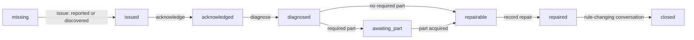
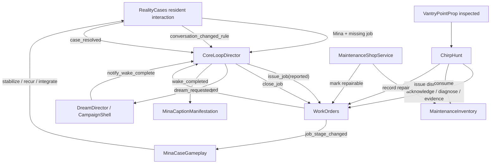

# Core loop — production contract

*Landed 2026-08-15. This is a reference for the K2–K6 code that exists. The
fiction and product sequence remain governed by `design/ORISON_BIBLE.md` and
`design/CLAUDE_LIVING_ORISON_EXECUTION_PLAN.md`.*

## What exists now

The production building contains one complete authored maintenance loop:
`vantry_chirp_2a`. It can begin with Mina's report or with the player finding
the failed Vantry point, requires a carbon transmitter capsule from HARDWARE
PAINT, returns to a physical repair, passes through Mina's two-visit case, arms
a dream request only after integration, and returns from the current test dream
stub to the authored 4B bedside. The wake applies one persistent factual
refrigerator caption.

N4 supplies the production campaign boundary and a reconstruction-only
DreamMazeRoot payload. N5 supplies protected, saved gradual onset and is the
sole production entry caller. There is still no playable dream geometry,
pursuit or hazard.

## Authority by owner

| Owner | Owns | Does not own |
|---|---|---|
| `MaintenanceJobLibrary` | Loading and validating `maintenance_jobs.json`; stage, origin and repair-quality vocabularies; authored objectives, bindings, evidence flags and dream-window metadata | Runtime progress, world-anchor existence or presentation |
| `WorkOrders` | The sole maintenance-job lifecycle; legal transitions; evidence and repair-result facts; simple legacy orders | Shops, inventory, dialogue, case truth, physical repair or dreams |
| `ChirpHunt` | The live `vantry_chirp_2a` fault: source selection, chirping, inspection-to-diagnosis flow, item-backed repair and legacy chirp-order migration | Job legality, item provenance, case resolution or dream timing |
| `VantryPointNetwork` / `VantryPointProp` | The authored point location, batched/static handoff, sound emitter, grille/telltale mechanism and repaired physical state | Persistent job facts |
| `MaintenanceInventory` | Whether a maintenance item was acquired or consumed, once per campaign, and its shop provenance | Stock, currency or job stage |
| `MaintenanceShopService` | Stock validation, counter placement and the acquisition transaction | Item facts or lifecycle legality; it calls the two owners that hold those facts |
| `MaintenanceShopCounter` | The physical `E` adapter at an authored counter | Stock, items or jobs |
| `RealityCaseManager` | Case stage, repair count, recurrence, conversation flags, resolution and the resulting portal rule | Work-order closure or physical repair |
| `MinaCaseGameplay` | Mina's evidence interactions, dialogue entry, visit boundary, calibration and the translation from the first completed repair to case stabilization | Maintenance lifecycle or orchestration facts |
| `CoreLoopDirector` | Connecting authoritative events, the six coarse loop boundaries, protected dream request and safe wake return | Lifecycle rules, transactions, fault behavior, dialogue, case truth, sleep pressure, dream gameplay or presentation |
| `CampaignShell` / `DreamDirector` | The exclusive waking/dream WorldSlot, forward-only dream transaction and rebuild-before-wake order | Onset timing, topology, pursuit, hazards, case truth or work lifecycle |
| `SleepPressureDirector` | Seeded onset form, saved warning progress, protected/stable entry and the one production call into DreamDirector | Case eligibility, cure mechanics, maze, Tenant, hazards or work lifecycle |
| `ObjectiveTracker` | Presenting the current title and instruction | Owning or advancing any state |
| `RealityState` | The shared JSON save file and committed campaign facts | Domain rules for those facts |
| `MinaCaptionManifestation` | Mina's visible manifestation and the one idempotent waking residue applied after wake | Case resolution or wake orchestration |

`BuildingRoot` constructs one instance of each runtime owner and injects their
dependencies. A case script must not make a second lifecycle with private
booleans, and a new case must not get its own copy of the campaign director.

## Maintenance-job state machine

`WorkOrders` rejects every transition not listed here without mutation or
signal emission. A closed job has no outgoing transition.

| From | Public call | Additional gate | To |
|---|---|---|---|
| missing | `issue_job(job_id, reported\|discovered)` | job and origin exist in the validated library | `issued` |
| `issued` | `acknowledge_job(job_id)` | — | `acknowledged` |
| `acknowledged` | `diagnose_job(job_id)` | — | `diagnosed` |
| `diagnosed` | `mark_job_awaiting_part(job_id)` | job data names a required item | `awaiting_part` |
| `awaiting_part` | `mark_job_repairable(job_id)` | job data names a required item | `repairable` |
| `diagnosed` | `mark_job_repairable(job_id)` | job data names no required item | `repairable` |
| `repairable` | `record_job_repair(job_id, result)` | quality is `poor`, `fair` or `good`; note is a string | `repaired` |
| `repaired` | `close_job(job_id)` | — | `closed` |

`record_job_evidence()` is an idempotent side operation before closure. It
accepts only flags declared by that job's data. Reported and discovered origins
remain recorded facts but cease to branch the lifecycle after acknowledgement.

## Coordinator boundaries and signal contract

The coordinator deliberately compresses the practical stages. Its boundary
stays `job_open` while WorkOrders moves from `issued` through `repairable`.

| Coordinator boundary | Entered when | Leaves when |
|---|---|---|
| `idle` | no authored golden-loop job exists | Mina reports it, it is discovered, or an existing job is reconciled at setup |
| `job_open` | the job exists | WorkOrders emits its transition to `repaired` |
| `conversation_pending` | the physical repair is committed | `RealityCases.conversation_changed_rule` reports Mina's complete resolution rule while the job is still repaired |
| `conversation_complete` | CoreLoopDirector successfully closes the repaired job | `RealityCases.case_resolved` commits final integration and the authored dream window passes |
| `dream_pending` | the integrated case has an eligible dream window | DreamDirector completes its return transaction and calls `notify_wake_complete()` |
| `wake_complete` | wake is accepted and the player is returned to the authored bedside | terminal for this one-job implementation |

Exact public signals:

| Signal | Emitter | Production consumers / current status |
|---|---|---|
| `job_issued(job_id, state)` | WorkOrders | general notification seam; service-set state also refreshes from lifecycle/state signals |
| `job_stage_changed(job_id, from, to, state)` | WorkOrders | CoreLoopDirector, MinaCaseGameplay and the service-set ORDER indicator |
| `part_acquired(item_id, shop_id)` | MaintenanceInventory | public acquisition seam; current loop reads authoritative inventory facts |
| `part_consumed(item_id)` | MaintenanceInventory | public consumption seam; current loop reads authoritative inventory facts |
| `resident_interaction_requested(case_id, resident_id)` | RealityCaseManager | CoreLoopDirector hears the report; MinaCaseGameplay opens the appropriate authored conversation |
| `conversation_changed_rule(case_id, flag, state)` | RealityCaseManager | CoreLoopDirector; emitted only for a newly added, data-declared resolution flag |
| `case_resolved(case_id, state)` | RealityCaseManager | CoreLoopDirector opens the post-case dream window |
| `conversation_requested(case_id, resident_id)` | CoreLoopDirector | currently a tested orchestration seam with no production dialogue subscriber; the player starts Mina's earned conversation through ordinary resident interaction |
| `dream_requested(case_id, profile_id, window)` | CoreLoopDirector | DreamDirector; identity is data-authored and no longer inferred from the fixed job id |
| `wake_completed(anchor_id)` | CoreLoopDirector | MinaCaptionManifestation applies/reconciles the waking residue |

Closing a dialogue panel is not a rule change. Recording an ordinary or
duplicate flag is not a rule change. Repair alone is not case resolution.

## Complete Mina shift

1. The failed 2A Vantry point chirps before paperwork exists. Mina interaction
   issues `vantry_chirp_2a` as `reported`; inspecting the point first issues it
   as `discovered`. The paths converge at `acknowledged` without changing the
   recorded origin.
2. Inspecting `F02_A_MAIN_VANTRY_POINT` opens the grille, diagnoses the failed
   carbon capsule, records all three authored evidence flags and reaches
   `awaiting_part`. A different grille changes no job fact.
3. HARDWARE PAINT's counter appears at
   `storm_shop_hardware_paint_counter_top`. It offers
   `carbon_transmitter_capsule` only while a matching job awaits it. Buying
   records the item and advances the job to `repairable`; a second purchase is
   refused.
4. Returning to the point and pressing `E` consumes the capsule, records a
   `good` repair, closes and quiets the physical grille/telltale mechanism, and
   stops at job stage `repaired`. CoreLoopDirector enters
   `conversation_pending`; MinaCaseGameplay translates this first physical
   intervention into one temporary case stabilization.
5. Mina's first earned conversation names the silence but closes nothing. The
   lobby time clock advances the visit, the manifestation recurs, three factual
   caption observations and the calibrator supply the second stabilization.
6. The second real conversation records the two case-declared resolution flags.
   Only when the case reaches `integration_ready` does
   `conversation_changed_rule` allow CoreLoopDirector to close the repaired
   work order. The final silent calibration resolves the case and commits the
   portal rule, `Silence does not require annotation`.
7. Case resolution evaluates the job's dream window. While `player.call_locked`
   is true the request stays armed but cannot emit. Once protection releases,
   `dream_requested(mina_caption_crisis, mina_release_print, window)` emits
   exactly once for that arming. DreamDirector persists it; SleepPressureDirector
   then pauses through engagement, unstable footing, the lift seam or traffic,
   completes the authored warning and requests entry exactly once.
8. K6's direct-building harness still uses a test stub. N4's production
   CampaignShell instead rebuilds waking Orison and lets DreamDirector call
   `notify_wake_complete()` during its return transaction. The coordinator
   returns the player to the bedside derived from the unique F04 `bed` furniture
   record, preserves all job/case/item facts, and emits `wake_completed`.
   MinaCaptionManifestation then commits the one
   `mina_factual_refrigerator_caption` residue at the generated refrigerator
   marker/socket. Duplicate wake and duplicate residue calls are rejected.

## Persistence contract

`RealityState` is the save owner. Its production path is
`user://reality_maintenance_save.json`; every domain mutation below calls
`RealityState.commit()`. Presentation text and physical animation state are
rebuilt from facts rather than saved as copies.

| Save path | Owned facts | Reconciliation behavior |
|---|---|---|
| `maintenance_jobs[job_id]` | `stage`, `origin`, `evidence`, `repair_result`, `issued_at`; optional `migrated_from` | WorkOrders validates pure-fact restores and re-presents every open job from library text |
| `maintenance_items[item_id]` | `shop_id`, `consumed`, `acquired_at`; `consumed_at` after use | Inventory restore validates shape/provenance; spent records remain instead of being deleted, so load cannot mint the item again |
| `cases[case_id]` | case stage, repairs, recurrence, intensity, trust, conversation flags, apartment changes, pending/resolved flags | RealityCaseManager remains the only rule owner; MinaCaseGameplay idempotently translates an already repaired job into its first stabilization |
| `core_loop` | `active_job_id`, `boundary`, `conversation_requested`, `conversation_complete`, `dream_pending`, `safe_return_anchor` | Defaults self-heal; setup reconciles a pre-existing job; conversation requests do not duplicate; a new session re-arms one pending dream request |
| `dream_seed` / `dream` | exact 16-hex-digit campaign seed; phase, active flag, case/profile/window, copied `seed_hex`, maze revision and outcome | CampaignShell reconstructs only waking or dream; entered/active restart at D00; return-pending reconciles forward and clears last |
| `sleep_pressure` | selected onset form, elapsed seconds and whether warning began | SleepPressureDirector resumes the exact warning; transient safety block reasons are reconstructed, not saved |
| `waking_residues[residue_id]` | case/job provenance, generated anchor/socket ids and text | `apply_waking_residue` refuses duplicate ids; manifestation reconstructs the label after boot/load |
| `last_waking_residue_id` | most recently applied residue id | presentation lookup only |

The tested restore boundaries are: no job; issued/acknowledged; awaiting part;
part acquired/repairable; repaired/conversation pending; conversation complete;
dream pending; and wake complete. The continuous harness writes and reloads a
real JSON file under `user://tests/`, deletes only that contained test save, and
never touches the player's production save.

The old simple order `WO-VANTRY-001` has a narrow migration: `issued` maps to
`issued`, `active` to `acknowledged`, and `closed` to `awaiting_part` with the
authored evidence. A legacy close means the grille was found and opened, not
that the new capsule repair happened. Migration never overwrites an authored
job and retires the legacy record after a successful adoption.

## Adding the second case

Adding JSON alone is not sufficient. The current director is intentionally a
one-job vertical slice: `JOB_ID` is fixed to `ChirpHunt.JOB_ID`, `core_loop` is
one record, and `wake_complete` is terminal. Generalize that seam before Peter
or any other second case is enabled.

1. Add one validated job definition to `maintenance_jobs.json`: unique id,
   reported/discovered sources, case/resident/unit binding, real generated
   anchors, declared evidence, all seven objective strings and a dream window.
2. If procurement is required, add a unique stock id to
   `shop_inventory.json`. Maintenance items are grant-once per campaign, so a
   reusable part name must not accidentally make a later errand impossible.
   Use an existing fictionally correct shop and a generated counter anchor.
3. Build a case-specific physical fault customer with the same narrow contract
   as ChirpHunt: it may call public lifecycle and inventory methods, but it may
   not store a parallel stage, own shop facts or resolve the case. Put lasting
   mechanism state on its prop and derive/reconcile it from authoritative facts.
4. Bind the physical repair to the case in a case-gameplay owner. Repair may
   stabilize a symptom; only RealityCaseManager may record recurrence,
   integration and resolution.
5. Refactor CoreLoopDirector around a validated active-job/profile record (or a
   small data-driven job registry) while retaining one coordinator. Replace the
   fixed job id and terminal singleton assumptions; do not create a Peter
   director, a second WorkOrders, or case-specific branches inside the shared
   owners. Preserve foreign-job filtering on every signal.
6. Keep conversation closure authoritative: a new data-declared resolution
   flag may close a repaired job only when that case is genuinely
   `integration_ready`. The later `case_resolved` event, not UI closure, opens
   its dream window.
7. Give the shared dream boundary the job/case profile and a safe authored
   return anchor. Case content may change maze grammar and waking residue;
   scene ownership, persistence and wake acceptance stay shared. See
   `game/docs/dream_boundary.md` for the landed N4 contract.
8. Extend focused tests first: schema rejection, both origins, every legal and
   illegal transition, wrong-shop/item refusal, duplicate calls, rule-change
   filtering, protection, each real-file save boundary and wake idempotence.
   Then add one continuous production-scene walk. Existing Mina behavior must
   remain unchanged.

## Verification

- `CoreLoopTest.tscn` exercises the focused owner graph, both origins, foreign
  event filtering, every coordinator boundary and restore behavior.
- `GoldenLoopTest.tscn` is the authoritative continuous Mina shift: production
  scene, walked 2A → ORISON → STREET → PASSAGE → HARDWARE PAINT route and
  return, repair, both conversations, recurrence, integration, protected dream
  onset, stubbed wake, waking residue and real-file checkpoints.
- `MaintenanceJobTest.tscn`, `MaintenanceErrandTest.tscn` and
  `MaintenanceCounterTest.tscn` isolate lifecycle, transaction and physical
  interaction failures when the larger trace points at one boundary.
- `DreamBoundaryTest.tscn` destroys and real-file-restores the persistent
  campaign shell at armed, entered, active, return-pending and awake.

Fresh K7 proof on 2026-08-15: CoreLoopTest passed 28/28 focused checks with
`idle | job_open | awaiting_part | repairable | conversation_pending |
conversation_complete | dream_pending | wake_complete`; GoldenLoopTest passed
87/87 checks across all
13 ordered production-scene blocks in 38.2 seconds. Its unrelated resident
schedules emitted known wall-safe-route warnings after the PASS verdict; no
loop assertion failed. One preceding GoldenLoop invocation exceeded the
external 60-second limit without a verdict and left its Godot child active; the
specific processes were terminated before the clean rerun. Do not run another
instance on top of an overrun.

Run only one Godot process at a time and bound each invocation to 60 seconds.
The exact executable and import rules are in `HANDOFF.md`.
