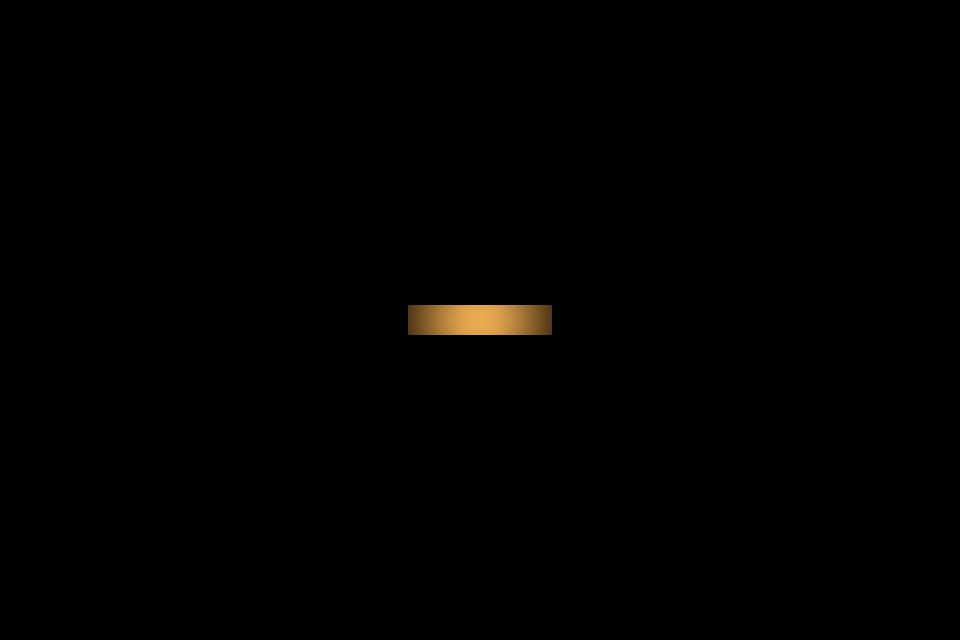
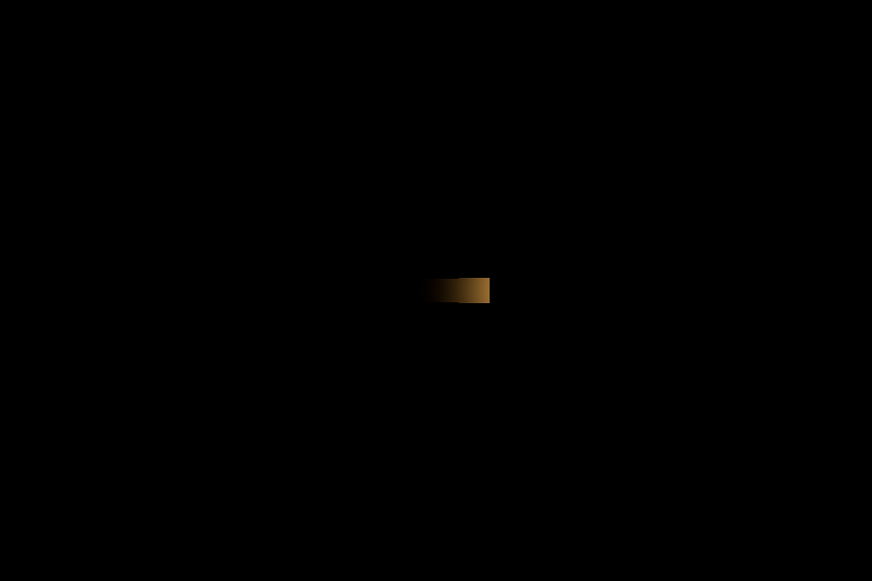
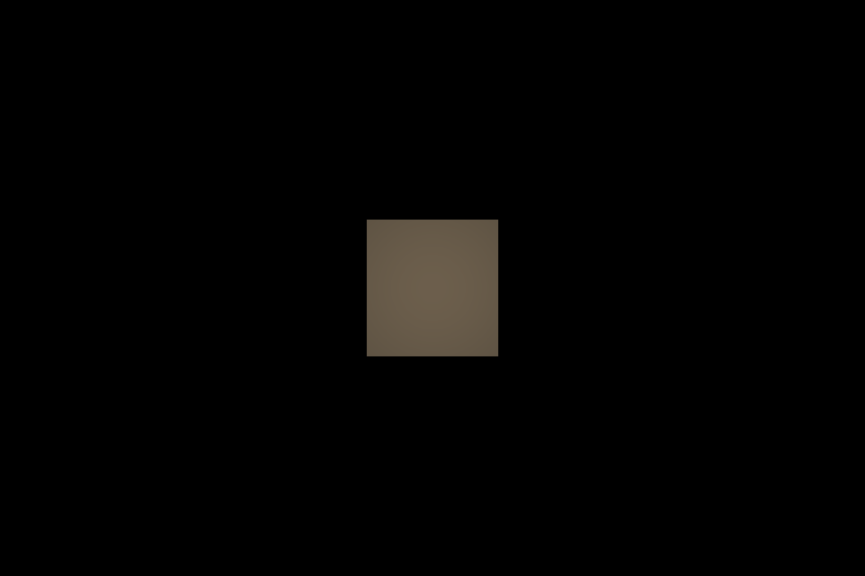
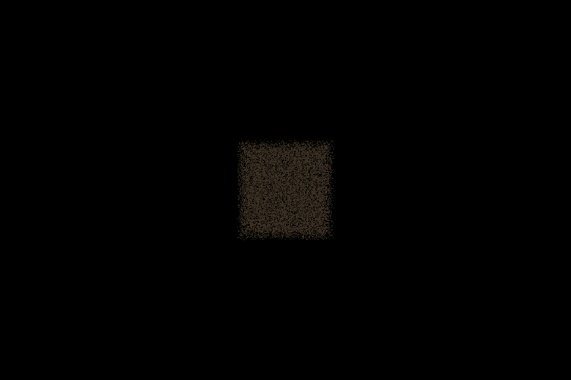
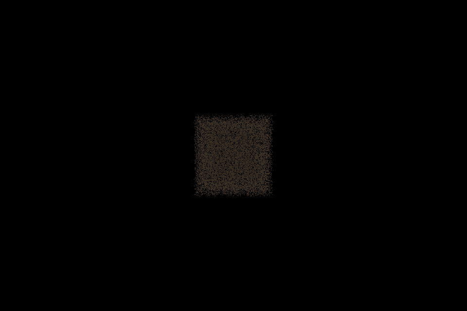

# Isolated lamp optical field

**149 native checks passed; zero failures; empty engine stderr.** This change stops at isolated optical and performance proof. It does not merge into the game, supersede S2J, resume anatomy art, or declare L1D/production accepted.

[Results](evidence/isolated_03/receipt.json), [tested source hashes](evidence/isolated_03/run_manifest.json), and [engine log](evidence/isolated_03.log) identify the reviewed run. Earlier development runs are excluded from committed evidence.

## Transition corrections after the initial proof

The original 103-check run at `3ea1968` remains preserved in `evidence/isolated_01`. A follow-up review reproduced three failed checks against that field implementation: near-zero energy could suppress the off transition, ownership remained with the old field after rebinding, and its disposal could erase the new binding. [The failing check record](evidence/isolated_02/regression_before.json) and [original stderr](evidence/isolated_02/regression_before.stderr) preserve that result.

Off/on transitions now bypass the small intensity-change threshold. Native checks cover both directions at base energy 0.000001 and verify an entirely zero GPU radiance texture after off. Material binding transfers ownership explicitly: the previous owner releases the material, and later teardown cannot clear its replacement's textures. Hero-to-production transfer clears the old near-cascade bindings. `unbind_material(material)` supports participants leaving a live field; repeated binding/unbinding is harmless. Eight additional native checks cover these transitions, bringing that checkpoint to 111.

## Invalid-input and stationary-update contract

A subsequent check reproduced acceptance of a zero-range lamp against `7a336e5`; [the failing record](evidence/isolated_03/regression_before.json) and [stderr](evidence/isolated_03/regression_before.stderr) preserve it. The current 149-check suite adds invalid-input, GPU clearing, recovery, and stationary-scattering coverage.

Missing/detached lamps, singular/nonfinite transforms, invalid range/energy/color/stability/rate/scattering, and invalid initialization tiers/focus ranges are rejected. `observe()` returns false and sets `last_observation_error`; it disables sampling and clears both GPU volumes instead of retaining the previous light. A later valid observation reconstructs light and clears the error. This does not mutate the accepted controller. Initialization errors remain in `failed` and require a new field instance.

Ranges must be finite, above the 5 mm near plane at GPU float32 precision, and at most 1e12 m (a shader numeric guard, not useful scene coverage). Incident spectral energy must fit the 65504 half-float maximum. Scattering is constrained to [0, 1]. Off/invalid injection clears before evaluating geometric inputs, preventing rejected geometry from creating invalid texture values. Changing scattering while stationary now invalidates both cascades; optical-channel GPU readback verifies the new values in the diagnostic path.

## Authority and architecture

`LampOpticalVoxelField` reads the accepted instrument's pose, range, cone, intensity multiplied by base energy, spectral color, stability, and rate of change. It does not advance electrical state, switch power, save progression, or accumulate history. Units are normalized/authored energy, not calibrated radiometry.

`DreamExposureField` is unchanged in the parent game and is not loaded or sampled in this lab. A future production material may independently multiply ecological state by instantaneous illumination. No production shader or anatomy asset changed.

The accepted controller, instrument, and fog shader are byte-for-byte mirrors from the worktree at `10e3d0b7141063d3c317c2f74c2c6946be2bcf70`; [accepted_sources.json](accepted_sources.json) records their SHA-256 values. The fixture selects the instrument's existing tier 0 without changing tier definitions or controller implementation.

Production uses a 48 x 48 x 64 frustum from 5 mm to the accepted lamp range (9 m here). Hero retains that room field and adds a 96 x 96 x 128 near cascade ending at 0.6 m, blending across 0.48-0.6 m. Coordinates follow the lamp, independently of the camera. Quadratic depth sampling favors the source/near subject.

Each cascade owns two RGBA16F 3D textures, a persistent 368-byte parameter buffer, shader, pipeline, and uniform set. `Texture3DRD` shares the main RenderingDevice textures directly. Radiance RGB stores incident energy; A stores mean transmittance. The second texture stores visibility, depth, bounded scatter, and stability. Radiance averages visibility times transmission **per source ray**, preserving their correlation.

Up to eight validated AABBs supply opacity and Beer absorption. Four finite-source rays give a controlled filtered boundary. Rejected geometry does not replace valid geometry. This is bounded analytic occlusion, not arbitrary mesh voxelization. Every injection overwrites every voxel. The shared sampler explicitly rejects off, behind, radial range, cone, and frustum exclusions; no modulo wrapping or history texture exists.

Hero lateral pitch at 5 cm is 0.735 mm; depth pitch is about 2.6 mm. Analytic slab absorption can represent thinner slabs without assigning them a whole voxel, but the resulting field remains spatially filtered. This evidence does not establish arbitrary micron-scale anatomy or room-wide microscopic shadows.

## Materials and proof

Both spatial shaders and the diagnostic probe use [one sampling include](shaders/lamp_optical_sample.gdshaderinc). The scene contains receiving faces, a thin slab, sealed blocker, narrow metallic strip, cloudy sealed box, 256 particles, ten material variants, and an explicit froxel visualizer. Scripted translation and rotation move the actual accepted instrument.

[The surface shader](shaders/optical_receiver.gdshader) implements roughness-sensitive diffuse/specular response, wet microrelief and grazing response, directional fibers, Beer thickness response, bounded subsurface contribution, and narrow reflective gold. Gold writes no emission. This isolated surface shader expects the accepted lamp as its single light driver; additional arbitrary scene lights require an integration adapter.

[The cloud shader](shaders/optical_cloud.gdshader) integrates 24 samples through the sealed box. Incident-field attenuation describes lamp-to-sample transport; ray integration separately attenuates sample-to-eye transport. Front, rear, and combined partial internal blockers yield different rendered attenuation. These are technical depth coupons, not anatomy modifications.

Thin/glass/cloud use alpha hashing instead of sorted alpha blending. Technical captures show its grain; this is not a finished refraction treatment. The glass order check changes one receiver's render priority, not every intersecting transparent-mesh arrangement.

| Required proof | Representative receipt check | Result |
|---|---|---|
| 1. Off zero | `entire_off_texture_zero` | Pass |
| 2. On bounded | `on_nonzero` | Pass |
| 3. Behind/cone/radial exclusions | `world_bounds` | Pass |
| 4. Near exceeds far | `near_exceeds_far` | Pass |
| 5. Pose moves field | `rotated_cpu_gpu_staging_matches` | Pass |
| 6. Carved shadow | `rendered_opaque_carved_shadow` | Pass |
| 7. CPU/GPU injection | `open_cpu_gpu_staging_matches` | Pass |
| 8. Shader/reference tolerance | `hero_blend_filtered_world_samples` | Pass |
| 9. Shared material sampler | `all_ten_families_share_sampler` | Pass |
| 10. Thickness transmission | `family_03_rendered_thickness` | Pass |
| 11. Internal depth | `rendered_internal_depth_partial_occlusion` | Pass |
| 12. Reflective gold | `gold_view_dependent_glint` | Pass |
| 13. Visible temporal behavior | `rendered_temporal_instability` | Pass |
| 14. No moved-away history | `translated_old_beam_zero` | Pass |
| 15. Lifecycle | `all_new_scene_owners_released` | Pass |

Voxel-center GPU samples match independent CPU queries. Additional CPU trilinear reconstruction verifies off-grid shader samples and cascade blending. Absolute tolerance is 0.003 in the tested half-float channels; largest off-grid error is 0.002065. This does not equate a filtered shadow boundary with an unfiltered analytic ray.

All ten rendered variants respond to on/off. The gold check compares aligned and angled camera positions. Equal-duration temporal sequences use the accepted controller with and without sustained mechanical shock; the unshocked baseline still contains its natural drift/contact behavior.

## Performance

Godot 4.7.1-stable, Vulkan Forward+, RTX 4080, 960 x 640, VSync off. Each configuration restores the same controller snapshot, warms 30 frames, and measures 120 frames at manual 1/120 s cadence. Housing, labels, and camera stay constant. Field-only cases use analytic receiver materials. Empty/analytic baselines own no field allocation.

Cells show **median / p95 / maximum**. CPU/GPU-field columns are microseconds; viewport GPU is milliseconds; VRAM is MiB above the empty baseline. Hero's near cascade is reported separately.

| Configuration | CPU build us | Submission us | GPU field us | Viewport GPU ms | Draw calls | VRAM delta MiB |
|---|---|---|---|---|---|---|
| empty | n/a | n/a | n/a | 0.040 / 0.041 / 0.041 | 23.000 / 23.000 / 23.000 | 0.000 / 0.000 / 0.000 |
| analytic | n/a | n/a | n/a | 0.045 / 0.046 / 0.047 | 33.000 / 33.000 / 33.000 | 0.000 / 0.000 / 0.000 |
| field_no_occlusion | 9.000 / 10.000 / 49.000 | 6.000 / 7.000 / 8.000 | 5.248 / 5.600 / 5.856 | 0.045 / 0.046 / 0.047 | 33.000 / 33.000 / 33.000 | 2.250 / 2.250 / 2.250 |
| field_occlusion | 10.000 / 11.000 / 21.000 | 6.000 / 7.000 / 8.000 | 7.104 / 7.520 / 7.680 | 0.046 / 0.047 / 0.055 | 34.000 / 34.000 / 34.000 | 2.250 / 2.250 / 2.250 |
| opaque | 10.000 / 10.000 / 12.000 | 6.000 / 7.000 / 7.000 | 5.600 / 6.016 / 6.048 | 0.066 / 0.067 / 0.067 | 28.000 / 28.000 / 28.000 | 2.250 / 2.250 / 2.250 |
| transparent_sss | 9.000 / 10.000 / 12.000 | 6.000 / 7.000 / 12.000 | 5.600 / 6.048 / 6.176 | 0.074 / 0.074 / 0.075 | 27.000 / 27.000 / 27.000 | 2.250 / 2.250 / 2.250 |
| particles | 10.000 / 11.000 / 20.000 | 6.000 / 7.000 / 8.000 | 5.152 / 5.664 / 5.760 | 0.076 / 0.077 / 0.091 | 26.000 / 26.000 / 26.000 | 2.250 / 2.250 / 2.250 |
| combined_production | 10.000 / 11.000 / 14.000 | 6.000 / 8.000 / 12.000 | 6.720 / 7.232 / 7.616 | 0.098 / 0.099 / 0.110 | 48.000 / 48.000 / 48.000 | 2.250 / 2.250 / 2.250 |
| combined_hero | 9.000 / 10.000 / 11.000 | 3.000 / 3.000 / 4.000 | 6.496 / 6.880 / 6.976 | 0.098 / 0.099 / 0.100 | 48.000 / 48.000 / 48.000 | 20.251 / 20.251 / 20.251 |

Hero near cascade: CPU 7.000 / 8.000 / 13.000 us; submission 7.000 / 7.000 / 8.000 us; GPU generation 30.112 / 30.624 / 30.912 us.

Production controller: 14.000 / 15.000 / 29.000 us, with maximum below 200 us. Conservative median optical overhead is **0.060 ms**: combined viewport minus analytic viewport plus field generation. This small isolated scene passes the requested 2 ms target. No larger scene, higher resolution, overlapping-volume stress test, or production frame budget is implied.

GPU sampling cost is estimated against the same material/geometry with the shared sampler's diagnostic constant-input bypass enabled. Transfer functions/render paths remain active. This is an engine GPU timing difference, not an external per-instruction capture. Near-zero and negative differences reflect timer quantization/noise and remain signed.

| Configuration | GPU sampling delta ms: median / p95 / maximum |
|---|---|
| combined_hero | 0.002 / 0.010 / 0.011 |
| combined_production | 0.001 / 0.003 / 0.014 |
| opaque | -0.001 / 0.000 / 0.001 |
| particles | 0.002 / 0.004 / 0.016 |
| transparent_sss | 0.000 / 0.001 / 0.002 |

Each measured field-enabled interval contains 120 updates/uploads per active cascade. Per-frame count statistics and zero readback calls are recorded. GPU allocation and texture/matrix binding counters remain fixed during measured intervals; actual pose or cone/range changes update the relevant transforms/shapes. Ordinary injection performs no readback, source loading, or resource creation. Diagnostic readbacks occur outside timing intervals. Driver-internal stalls are not separately attributed; CPU build/submission tails remain reported.

GPU field generation uses RenderingDevice timestamp pairs. The exact [4.7.1 Vulkan driver](https://github.com/godotengine/godot/blob/4.7.1-stable/drivers/vulkan/rendering_device_driver_vulkan.cpp) returns nanoseconds from `timestamp_query_result_to_time`; differences are divided by 1000 for microseconds. [RenderingServer viewport GPU timing](https://docs.godotengine.org/en/stable/classes/class_renderingserver.html#class-renderingserver-method-viewport-get-measured-render-time-gpu) is already milliseconds. CPU wall time is never labeled GPU time.

## Lifecycle and reproduction

Initialize during setup, wait for `ready` or `failed`, bind each participant once, provide validated occluders, and call `observe(lamp)` after the accepted controller/presentation update. Forced observations are used only for this update-cadence benchmark. Call `unbind_material(material)` when a participant leaves, and `dispose()` before releasing the last field owner, including after initialization failure. The field is intentionally not serializable.

Disposal unbinds textures, frees six RIDs per cascade, and breaks callable ownership. Tests cover repeated initialization/disposal, disposal before initialization, and disposal while initialization is queued. Shutdown clears overrides, debug geometry, particles, viewport/capture references, and texture wrappers. **88 tracked newly owned objects/resources have zero retained references**, with no engine leak output. Engine-owned/preloaded shader caches are outside this owner count.

```powershell
& ./optical_lab/tools/run_lab.ps1 -EvidenceName current
```

Requires `Godot_v4.7.1-stable_win64_console.exe` on PATH. The copied exclusive Windows runner is unchanged from the canonical runner. It refuses an occupied native lane; it does not stop foreign engines. The wrapper rejects nonempty stderr even after exit 0 and records tested-source hashes. `evidence/current` is ignored; `isolated_03` is the reviewed evidence.

## Captures









Remaining material and temporal captures accompany the receipt. The explicit froxel overview uses a diagnostic display gain of 2; receiver captures and performance use actual optical values.
